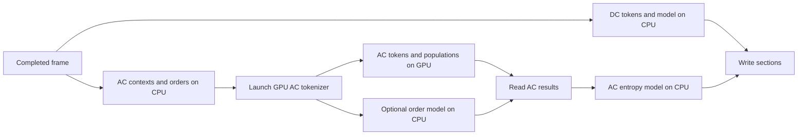

# CUDA earlier DC and entropy scheduling

Qualified on 2026-10-08 on `cuda/early-entropy-scheduling`, based on merged main
`a127963`. Eligible CUDA single-image calls now use both earlier DC preparation
and earlier entropy readiness by default. The existing capacity and route
fallbacks remain in effect.

## Scheduling change

The merged CUDA tokenizer already launches GPU AC work before CPU DC
tokenization, then waits for the AC result after DC tokenization. This change
enables the shared scheduler's two further steps: start DC before AC context and
order preparation, and prepare independent entropy models as their inputs become
ready. Section writing still waits for both branches.

The shared admission rule reserves all desired DC participants plus one AC
participant before forking. It falls back if either the per-image or shared CPU
budget cannot grant the complete reservation. Batch calls, including explicitly
enabled GPU-token batches, retain their existing schedule. CPU-token routes,
rate-optimized serialization, explicit nesting and detailed serializer profiles
also retain their existing exclusions. Public timing-only calls use the normal
schedule. See [capacity rules](entropy-readiness-capacity-policy.md) and
[earlier DC preparation](earlier-dc-preparation.md).

`GJXL_EARLY_ENTROPY=0` restores the original Begin / CPU DC / Finish schedule.
`GJXL_EARLY_DC=0` retains earlier entropy processing but starts DC after GPU AC
launch. The entropy opt-out takes precedence. Configure these process-wide
controls before encoding, without concurrent environment changes.

The completed coefficient device copy and native host frame remain in place.
This change does not remove coefficient readback, change codec policy, or move
entropy coding and bitstream writing onto the GPU.

## CUDA contracts

CUDA backend operations select their device on the executing thread. The
serializer captures its provider before dispatch, propagates memory and CPU
contexts, and joins both branches before releasing provider storage or completed
coefficients, including failure paths. The existing conservative storage bound
sums the overlapping token/model envelopes and the outer dispatcher's storage.

The private tokenizer counters now attribute worker execution to the provider's
creating caller. Their updates use atomic references; observations are read
after synchronous serialization has joined its workers. This fixes a test
observation that previously depended on which thread won the AC task.

## Qualification

Hardware: RTX 3060 Laptop GPU (6 GiB), Ryzen 9 5900HS, Windows, CUDA 11.8,
MSVC 14.37, driver 577.00. Builds are Release, SM86, with the general tokenization
experiment disabled and the normal CUDA token provider enabled.

The complete native suite passed 172 tests. Follow-up checks cover the expanded
E1–E10 workflow matrix and the final fixture completion marker. The CUDA
readiness fixture exercises 360 schedule/fallback/failure cases, 12 concurrent
serializer calls sharing four CPU participants, and a provider created on one
thread and executed on another. The public workflow fixture exercises 216
bounded cases: E1/E4/E7, CPU limits 1/2/4, fully-resident/throughput, ordinary and
timing APIs, DC-group boundaries, repeated calls, and byte/summary parity.

All eight CUDA memcheck/initcheck runs pass: provider, workflow, batch, and the
new readiness fixture. Each requires a positive fixture-completion marker as
well as a zero-error sanitizer summary. One initial readiness run was rejected
because its stdout completion marker was absent despite exit status zero. An
explicit final stdout flush made completion observable on Windows; both final
instrumented runs passed. CI now enforces completion markers for these fixtures.

The initial three-image pilot compared the original schedule, earlier entropy
only, and the full schedule in one binary. All corresponding outputs matched;
12 outputs decoded independently with libjxl and matched archived merged-main
outputs.

### Main comparison

The wider comparison uses 12 images: four Kodak, four CLIC 2024, three distinct
12 MP scenes, and a 24 MP scene. Each image runs at E1/E2/E3/E4/E5/E8, distance
1.9 and CPU limit 8. The three schedules use the same binary, with GPU
tokenization enabled in every arm. Thus the results measure scheduling gains
beyond the already-merged GPU-token policy.

Six rounds rotate and reverse the schedule order. Each process performs one
validation call, two warmups and five timed complete ordinary public API calls.
The 1,296 processes contain 6,480 timed encodes and 10,368 calls in total. All
corresponding encoded outputs are byte-identical. Independent libjxl decoding
passed for all 72 image/effort combinations; 18 also match retained merged-main
outputs from the prior tokenization qualification.

The table reports the geometric mean across images of ratios of median latency
per schedule. Each schedule's median is taken over six process medians.
Negative values mean lower latency; these are not percentage speedup figures.

| Effort | Earlier entropy vs original | Full vs original | Full vs earlier entropy |
| --- | ---: | ---: | ---: |
| E1 | -10.71% | -12.24% | -1.71% |
| E2 | -10.05% | -10.13% | -0.09% |
| E3 | -11.30% | -11.74% | -0.50% |
| E4 | -8.00% | -10.09% | -2.27% |
| E5 | -7.72% | -6.69% | +1.11% |
| E8 | +0.67% | +0.28% | -0.38% |

Earlier entropy provides most of the improvement. Earlier DC adds a clearer
benefit at E1/E4, especially on the three 12 MP images: an additional 4.0–6.5%
at E1 and 3.8–6.2% at E4. Its incremental benefit is mixed elsewhere, including
small Kodak images and E5. The full schedule improves 59 of the 60 E1–E5
image/effort comparisons. The exception is the 24 MP E5 case (+1.93%, with three
of six paired rounds faster). E8 is approximately neutral overall, with
individual changes from -3.0% to +3.7%.

GPU telemetry reported thermal/power throttling. Small differences, especially
the mixed E8 results, do not establish universal gains or regressions. These are
warm-call qualification measurements on one machine; they do not replace a
fixed-quality or score-calibrated paper sweep, cold-start measurements, or
qualification on other CUDA architectures.

### CPU capacity and retained allocations

The restricted-capacity comparison covers the three pilot images at E1/E4/E8
with CPU limits 1/2/4, original versus full schedule, four balanced rounds, two
warmups and five samples. All 216 processes (1,080 timed encodes) pass exact
encoded-output checks. All 27 representative outputs decode independently and
match retained merged-main outputs.

At CPU limits 2/4, E1/E4 latency improves 3.6–6.8% on Kodak and 12.1–18.8% on the
CLIC image. The 12 MP image is approximately unchanged (-0.1% to -1.7%), where
the complete DC-plus-AC reservation cannot fit. CPU limit 1 always falls back;
its observed differences (-3.3% to +4.9%) illustrate measurement variability
with an unchanged execution schedule. E8 remains mixed (-2.9% to +3.5% at CPU
limits 2/4).

The retained-allocation check also passes 90 sequential large-image calls at
E1/E5/E8, using three distinct 12 MP scenes and 12-to-24 MP transitions without
manual cache trims. Both CPU-token controls and default GPU-token calls produce
exact bytes and repeated summaries, use the expected provider, and release CPU
and memory reservations. Twelve CPU-token canonical outputs decode with libjxl.

### Concurrent ordinary calls

Two public callers sharing one CPU-8 execution domain run the three pilot
images at E1/E4/E8, original versus full schedule, over four alternating rounds.
The 72 processes contain 1,296 concurrent calls and 72 serial controls. All
outputs and complete summaries match, the shared CPU ceiling holds, and no
participants or reservations remain after completion. Cohort timing ends when
both calls return, before output validation.

| Image | E1 cohort latency | E4 cohort latency | E8 cohort latency |
| --- | ---: | ---: | ---: |
| Kodak 01 | -3.84% | -5.01% | +1.59% |
| CLIC 097cb426 | -16.60% | -16.82% | -0.09% |
| Alpine lake 12 MP | +0.43% | -2.67% | -0.33% |

These results do not indicate a broad concurrent regression on the tested
machine. Admission still depends on capacity at the fork, so a caller may use
the original schedule when another caller occupies the shared domain. The
single-image policy favors latency; the batch API retains its existing schedule
and CPU-token default for throughput workloads.

### Higher efforts and rollout

A final comparison covers Kodak 01 and CLIC 097cb426 at E6/E7/E9/E10, with the
same three schedules, CPU limit 8, four balanced rounds, two warmups and five
samples. All 96 processes (480 timed encodes) produce exact outputs, and all
eight representative outputs decode independently. The full schedule reduces
E6 latency by 8.2%/14.3% and E7 by 5.3%/8.8% on Kodak/CLIC respectively. E9/E10
remain mixed (-0.7% to +2.4%). This two-image check does not establish broad
higher-effort performance.

The rollout retains both improvements by default. Earlier entropy supplies
most of the measured E1–E5 gain, and earlier DC adds consistent larger-image
benefits at E1/E4. E8–E10 results do not justify a claim of improvement, or an
effort/size threshold based on this dataset. Existing opt-outs support workload
comparisons without adding another policy selector. No codec output or quality
change was observed; all corresponding schedule outputs match exactly.

## Reproducibility

The [machine-readable results](cuda-entropy-scheduling-results.json) retain
per-image comparisons, paired-round counts, input hashes, binary hashes and
validation totals. Across the pilot, main, capacity and higher-effort studies,
9,048 timed encodes were checked; the qualification includes 131 independent
decodes. This is incremental scheduling qualification, not a new paper table.

The reproducibility bundle is local to this worktree at
`build/entropy-validation/`: build/test logs, commands, input and binary hashes,
raw timing samples, independent decode checks, sanitizer diagnostics and GPU
telemetry. Its `frozen/` directory preserves the candidate source patch, final
binaries and static libraries, harness sources, scripts, build configuration
and a content manifest. `report.py` audits completed phases against the raw
samples and retained encoded files before emitting `validation.json` and
`REPORT.txt`. Frozen paper studies are separate from this qualification.
