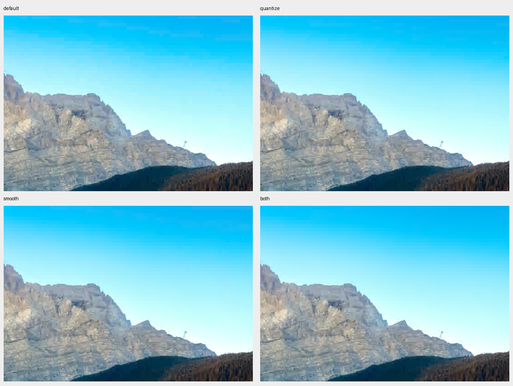

# Qualification of DC processing from effort 4

Qualification run: GJXL `8e8c49a42e69a24d469d4bcf0772a9e2c5012d6a`, Apple M4 Pro, fresh Release, fully resident Metal, eight CPU participants. Encoder defaults are unchanged. The candidate combines weighted prediction-aware DC quantization, one extra precision bit, and adaptive DC smoothing. The baseline already uses weighted prediction and adaptive DC trees.

## Recommendation

I support `both` as the automatic policy from e4 upward **when the policy prioritizes avoiding banding**, while keeping explicit overrides and leaving e1–e3 unchanged. The evidence supports a visual-quality tradeoff, not a promise of better rate at matched SSIMULACRA2. Both addresses the tested smooth/chroma signals more consistently than either feature alone, and the natural sky example shows why smoothing matters even when the metric prefers quantize.

The tradeoffs should be explicit: about 3–7% additional complete-encode time on these 12MP inputs, roughly 0–3% on most 24/48MP inputs, and 1.49–3.21% larger files at the unchanged distance 1.2 across the e4/e7 photographic cases. Matched-size low-quality photographs usually lose metric score and can lose texture. If the priority is minimum time or best rate at this metric, retaining the current default remains defensible; this qualification does not establish both as a universal winner. No automatic-policy change is included here.

## Photographic complete-encode cost

All 21 timing cases completed. Each uses an initial reference encode, three warmups, and 20 balanced AB/BA rounds of the complete public encode call at distance 1.2. File I/O, validation, and final diagnostic quality scoring are excluded. These costs measure a policy change at unchanged user settings, not matched-quality throughput.

Each table cell summarizes three photographs. Time is the median of their per-case paired time changes, with the observed case range in parentheses; size and quality are the medians of their same-distance changes. The three resolutions are derived from the same three scenes.

| Effort | Size | Encode time change | File-size change | SSIMULACRA2 change |
|---|---:|---:|---:|---:|
| 4 | 12MP | +6.53% (+2.65 to +7.07%) | +1.97% | +0.0382 |
| 4 | 24MP | +2.33% (+2.13 to +3.44%) | +2.11% | +0.1740 |
| 4 | 48MP | +1.06% (+0.09 to +1.08%) | +2.31% | +0.1226 |
| 7 | 12MP | +7.19% (+4.35 to +7.46%) | +2.07% | +0.2507 |
| 7 | 24MP | +1.76% (+0.36 to +2.75%) | +2.23% | +0.1001 |
| 7 | 48MP | +1.66% (+0.75 to +1.95%) | +2.44% | +0.2684 |

The e3 counterfactual costs +6.16 to +7.78% on 12MP; the proposed e4 threshold would leave e3 unchanged. Enabling both is not free, especially at 12MP. These are complete-workflow costs, including any changed AQ behavior; this study does not isolate the cost of the DC kernels.

Three baseline-versus-baseline controls had paired median changes of −1.07%, +0.10%, and +0.86%. Individual control rounds ranged from −4.28% to +8.83%. Treat changes around 1% cautiously. Rounds share one process per case and are not independent sessions. All accepted timing was on AC power with no recorded thermal/performance warning; normal desktop activity remained. Separate per-variant median milliseconds and median paired ratios answer different questions and can differ.

## Visible benefit and its cost

In the alpine photograph, smoothing reduces block-shaped sky banding at e4, most visibly at distance 6 and more subtly at distance 1.2. The four-mode comparison separates smoothing from the additional precision used by quantize:

| Alpine derivative, e4 / d6 | Bytes | SSIMULACRA2 |
|---|---:|---:|
| Default | 85,473 | 25.4554 |
| Quantize | 92,846 | 27.2431 |
| Smooth | 85,532 | 25.3782 |
| Both | 92,859 | 26.3440 |

Adding smoothing to quantize changes only 13 bytes, while reducing visible sky banding despite lowering SSIMULACRA2 by 0.8991 points. This is concrete evidence that the metric ranking misses a relevant visual tradeoff. Smoothing alone likewise improves the sky with only 59 additional bytes. At distance 1.2, all four scores are around 80 and the banding difference is subtler.

[Distance 1.2 crops](figures/alpine-e4-d1_2-modes.png) · [Matched-size alpine crops](figures/alpine-e4-d6-matched-size.png) · [Campus interior crops](figures/campus-e4-d3-matched-size.png) · [Full 16-bit mode-switching gallery](review.html). Figure crops preserve native spatial resolution but are 8-bit display copies; the gallery retains 16-bit sRGB images.

## Matched-size photographs

All 12 photographic targets at e4/e7 and distances 3/6 matched baseline bytes within 1%. Both retained smoother skies and flatter walls, but sometimes softened texture and detail. SSIMULACRA2 fell in 10 of 12 comparisons. Campus at distance 3 was the exception.

| Photograph | e4, d3 | e4, d6 | e7, d3 | e7, d6 |
|---|---:|---:|---:|---:|
| Alpine lake | −1.4180 | −3.5646 | −1.0077 | −3.1167 |
| Campus interior | +1.1859 | −0.9546 | +1.6640 | −0.1014 |
| Forest stream | −0.6828 | −2.0013 | −0.6048 | −1.9949 |

Values are both-minus-default SSIMULACRA2, not percent. Full distances, bytes, size errors, and probe counts are in [MEASUREMENTS.md](MEASUREMENTS.md). The low-quality matched-size results do not establish a universal rate/quality improvement. They complement the earlier local high-resolution, matched-SSIMULACRA2 study (`docs/dc-photo-large-qualification/REPORT.md`, outside this qualification package), which found only small, scene-dependent rate changes around distance 1.2. Those earlier observations are not pooled into this timing campaign.

## Corrected gradient diagnostics

Both improved SSIMULACRA2 over default **and** quantize on all 36 corrected gradient cases (four signals × three efforts × three distances). At e4, its improvement over quantize ranged from +0.1705 to +3.9064 points. Smoothing alone was less consistent on chroma: it reduced the score slightly at e4/d3 and by 0.6989 at e7/d6. The combination avoided those particular metric regressions. These are analytic stress signals, not photographic compression averages.

| Corrected gradient, e4 / d6 | Default bytes / score | Quantize bytes / score | Smooth bytes / score | Both bytes / score |
|---|---:|---:|---:|---:|
| Gray | 4,345 / 84.8289 | 6,039 / 91.8499 | 5,149 / 89.5030 | 5,318 / 94.4644 |
| Dark | 4,337 / 85.9463 | 5,920 / 92.5884 | 4,351 / 89.8766 | 5,738 / 94.9648 |
| Sky blue | 3,636 / 68.9199 | 4,390 / 84.5784 | 3,885 / 76.2340 | 4,363 / 88.4848 |
| Red-green chroma | 2,582 / 85.8572 | 2,475 / 90.2073 | 2,560 / 90.0936 | 2,548 / 91.2998 |

Five of 16 corrected gradient targets matched within 1%; all five improved score (+3.3176 to +14.0340). The other 11 remain unresolved: seven exhausted the 10-observation budget and four reached the distance bound. The matched-size search remains bounded: a failed target is not a matched comparison, regardless of whether its closest candidate has a higher score. Tiny gradient codestreams can have coarse and non-monotonic byte changes as distance changes. All failed targets, the closest size error, and the budget or distance-bound stop are retained in the measurements table.

At e4/d6, the amplified-error maps show the mechanism clearly: quantize reduces error magnitude, and smoothing softens the hard block-scale transitions. Both combines these benefits, although residual error remains. The unamplified sky and chroma crops show much subtler differences. Error ×40 must not be interpreted as the visible severity of the artifact.

[Gray error ×40](figures/gray-e4-d6-error.png) · [Dark error ×40](figures/dark-e4-d6-error.png) · [Sky error ×40](figures/sky-e4-d6-error.png) · [Chroma error ×40](figures/chroma-e4-d6-error.png).

## Effort 3 to 4 transition

At the same requested distance, the current e4 baseline already scores lower than e3 on all nine photographic derivative points. Both improves all nine current e4 points, but does not erase the existing discontinuity. For example, alpine d6 scores 30.6505 at e3 default, 25.4554 at e4 default, and 26.3440 at e4 both. The corresponding byte counts also differ. This study does not diagnose the existing effort/AQ behavior and it would be incorrect to attribute that drop to the proposed DC policy. See [transition.csv](transition.csv).

## Correctness and evidence handling

The [saved-data audit](audit.json) passed: 21/21 timing cases, three baseline controls, 252/252 fixed visual outputs, 414 distinct scored codestream artifacts including calibration probes, and 269 exact repeat-decode checks. All 1,094 commands belonging to the accepted records succeeded. All 28 matched-size searches terminated under the original limits: 17 matched, 11 explicitly unresolved. No accepted timing window overlapped monitored foreign encoder/build/scorer work.

Seven focused tests passed: CPU DC quantization/processing, Metal AQ reconstruction, Metal DC processing, and resident/CPU/compatibility storage planning. This includes 1,410 exact CPU-versus-Metal raw DC cases and 20 invalid cases with atomic rejection. The study's native benchmark checks repeated-output byte stability; independent float decoding verifies finite pixels and records decoded hashes. Visual review repeats the independent decode and checks exact pixel identity.

All original source/tool fingerprints were checked at closeout. The original collector is archived under `frozen-tools` before its synthetic generator was corrected. All nine e7 timing inputs reproduced the earlier study's default/both codestreams, decoded hashes, and quality scores exactly.

Initial timings overlapping other GJXL RCA jobs were excluded and preserved. Accepted controls and timing were collected under continuous process monitoring. Prelaunch background-load stops retained completed work. An interrupted duplicate gallery render was preserved and regenerated under an exclusive lock; encoded observations were unchanged.

All four original synthetic fixtures were excluded because large float64 expression evaluation in the installed Python/NumPy environment produced ranges inconsistent with the intended formulas. Their hashes were unchanged; the problem occurred at generation. A separate supplement uses explicit output buffers and independently checks scalar reference values, full-image finiteness/ranges, and constant chroma-ramp luminance before collection. The photographic inputs are unchanged. Float32 sRGB conversion was also checked exactly against the original implementation on all three photographic derivatives.

Raw evidence: `build/dc-e4-qualification-20260913-v1` (photographs, timing, tests) and `build/dc-e4-synthetic-corrected-20260914-v1` (replacement gradient cases). The original synthetic observations are never mixed with corrected ones. [PROTOCOL.md](PROTOCOL.md) preserves the prospective scope.

This is three natural scenes plus analytic diagnostics, not a broad photographic preference study. Visual inspection and amplified-error maps cannot establish blinded human preference on a calibrated display. Efforts 5, 6, and 8 were not independently swept; e4 and e7 are representative policy checks, not exhaustive effort qualification.
