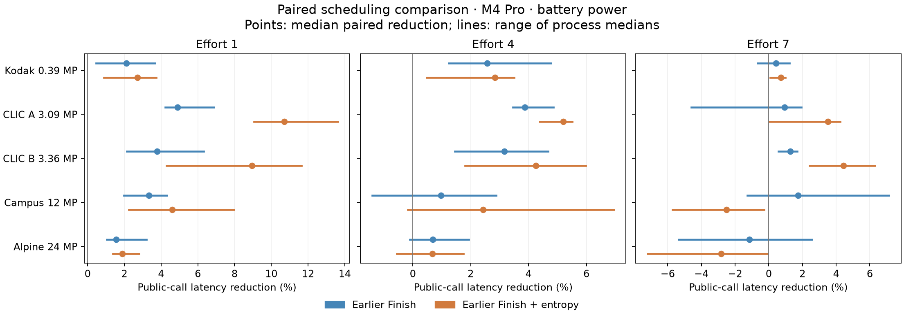
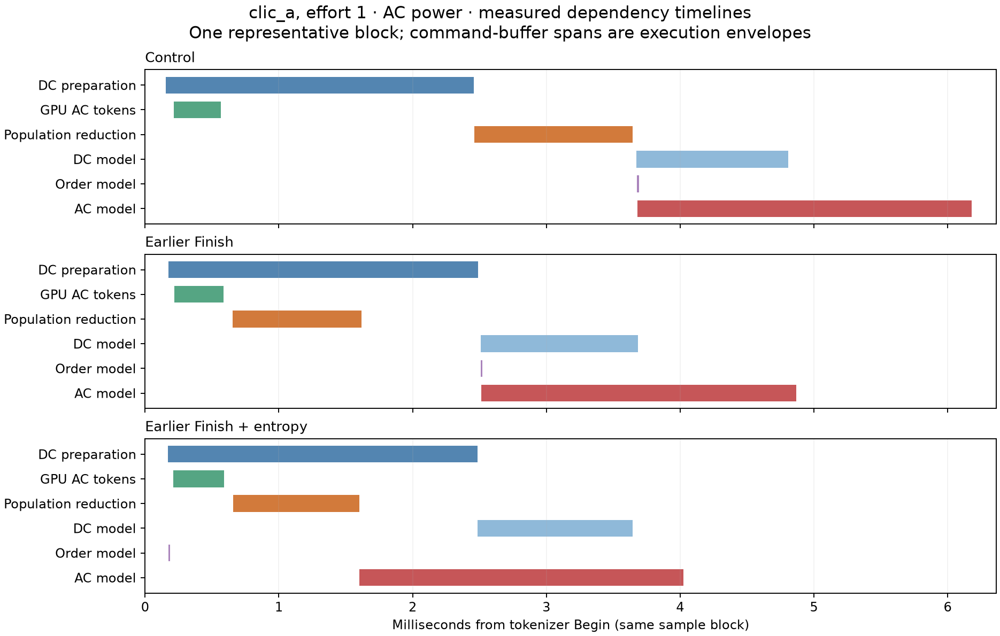
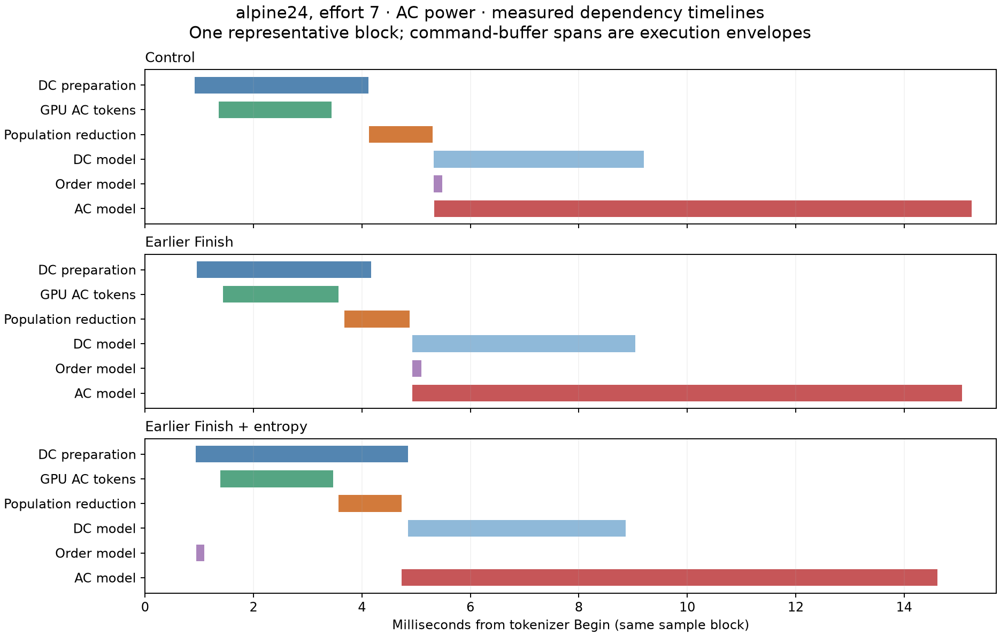

# Earlier population reduction and entropy readiness: measured prototype

This study tests two real CPU schedules in an isolated source snapshot. Positive reductions mean faster; negative reductions mean slower. Read [findings](FINDINGS.md) for the interpretation and [protocol](PROTOCOL.md) for scope and assumptions.

The primary comparison uses the same executable, input and output in counterbalanced mode-0/1/2 blocks. Mode 1 overlaps AC Finish with DC preparation. Mode 2 additionally starts ordinary entropy models on their own readiness conditions. GPU kernels, coding choices, earlier DC launch, context/order selection and section-writing dependencies are unchanged.

## Conditions and scope

Apple M4 Pro (14 CPU cores, 48 GiB), macOS 27.0 (26A428), Xcode 27.0 (27A266a), Apple Clang 21/libc++ 220106. The complete primary matrix ran on battery with recorded battery `powermode 1`; the user explicitly chose to continue under that condition. The machine later switched to AC during trace follow-up, so a separate AC confirmation set was added. The agent changed no power settings or other applications. Background activity remains in the process records. Power conditions are never pooled; transition processes remain separate. Absolute timings are not used to claim a speedup against the prior study.

Source revision `d71eeb034f1f1d7d8b1aee2775ed9fe18bb24e98` plus audited toolchain support, independent trace hooks, and the opt-in prototype. [Source/binary manifest](manifest.json), [measured source patch](measured-source.patch), [reconstruction instructions](README.md#retained-artifacts). The original checkout and index were preserved during measurement; the recorded audit predates this documentation commit.

Mode 2 uses the original schedule for rate-optimized efforts 8–10, native additive profiling, CPU=1, or unavailable CPU admission. Mode 1 can overlap completion at efforts 8–10. CPU-token paths also retain their original schedule. Trace activation is checked through `eager.selected`; a requested variant is not proof of activation.

## Complete-call latency: primary paired comparison

Battery power; distance 1.9, CPU limit 8, B1. Four independent processes × 18 measured blocks after three warmup blocks. Latency is the median control public call. Savings are medians of same-block differences, not differences between separately pooled medians. Percentages use the corresponding control call.

| Image | Effort | Control latency | Earlier Finish | Earlier Finish + entropy | Mode 2 process-median range |
| --- | --- | --- | --- | --- | --- |
| Kodak 0.39 MP | 1 | 6.738 ms | +0.141 ms / +2.11% | +0.181 ms / +2.72% | +0.89% to +3.74% |
| Kodak 0.39 MP | 4 | 7.312 ms | +0.196 ms / +2.58% | +0.214 ms / +2.84% | +0.48% to +3.50% |
| Kodak 0.39 MP | 7 | 16.489 ms | +0.071 ms / +0.44% | +0.122 ms / +0.71% | +0.09% to +1.00% |
| CLIC A 3.09 MP | 1 | 20.666 ms | +1.046 ms / +4.89% | +2.224 ms / +10.70% | +9.06% to +13.61% |
| CLIC A 3.09 MP | 4 | 23.818 ms | +0.961 ms / +3.86% | +1.225 ms / +5.21% | +4.38% to +5.52% |
| CLIC A 3.09 MP | 7 | 79.759 ms | +0.564 ms / +0.93% | +2.361 ms / +3.51% | +0.04% to +4.23% |
| CLIC B 3.36 MP | 1 | 27.463 ms | +0.997 ms / +3.79% | +2.440 ms / +8.96% | +4.28% to +11.64% |
| CLIC B 3.36 MP | 4 | 30.135 ms | +0.981 ms / +3.16% | +1.257 ms / +4.26% | +1.81% to +5.98% |
| CLIC B 3.36 MP | 7 | 91.481 ms | +1.150 ms / +1.27% | +4.204 ms / +4.42% | +2.43% to +6.30% |
| Campus 12 MP | 1 | 58.940 ms | +1.887 ms / +3.35% | +2.536 ms / +4.60% | +2.24% to +7.96% |
| Campus 12 MP | 4 | 69.319 ms | +0.747 ms / +0.98% | +1.728 ms / +2.43% | -0.17% to +6.95% |
| Campus 12 MP | 7 | 288.571 ms | +5.027 ms / +1.74% | -6.796 ms / -2.52% | -5.72% to -0.27% |
| Alpine 24 MP | 1 | 95.565 ms | +1.481 ms / +1.55% | +1.793 ms / +1.88% | +1.39% to +2.80% |
| Alpine 24 MP | 4 | 109.487 ms | +0.752 ms / +0.69% | +0.747 ms / +0.67% | -0.55% to +1.75% |
| Alpine 24 MP | 7 | 526.224 ms | -5.838 ms / -1.16% | -15.108 ms / -2.84% | -7.20% to -0.05% |

The process range shows reproducibility across four processes; it is not a confidence interval. The full [paired summary](analysis/summary.csv) includes p10/p90, min/max and sample counts. All raw pairs and calls remain in the [local archive](README.md#retained-artifacts). Pilot and traced calls are excluded from this primary table.

## Separate AC-powered confirmation

Same four-process/18-block comparison, run after the observed switch to AC. These results are kept separate from the battery matrix.

| Image | Effort | Control latency | Earlier Finish | Earlier Finish + entropy | Mode 2 process-median range |
| --- | --- | --- | --- | --- | --- |
| CLIC A 3.09 MP | 1 | 16.050 ms | +0.999 ms / +6.19% | +1.711 ms / +10.86% | +9.68% to +11.24% |
| CLIC A 3.09 MP | 7 | 55.956 ms | +1.061 ms / +1.90% | +1.817 ms / +3.23% | +2.56% to +3.70% |
| Campus 12 MP | 7 | 183.278 ms | +0.752 ms / +0.41% | +1.495 ms / +0.81% | +0.49% to +0.99% |
| Alpine 24 MP | 1 | 73.887 ms | +0.392 ms / +0.53% | +0.564 ms / +0.76% | +0.46% to +1.24% |
| Alpine 24 MP | 7 | 322.761 ms | +1.034 ms / +0.32% | +1.575 ms / +0.50% | +0.46% to +0.53% |

## What changed in the measured dependency chain

Trace durations below are milliseconds, from the separate two-process AC trace cohort. Trace and ordinary samples are not pooled. The earlier battery/transition trace follow-up remains in the raw tables.

| Case | Metric | Control | Earlier Finish | Earlier Finish + entropy |
| --- | --- | --- | --- | --- |
| CLIC A 3.09 MP / e1 | gpu_ready_to_reduction | 1.868 | 0.069 | 0.075 |
| CLIC A 3.09 MP / e1 | token.population_reduce.cpu | 1.083 | 1.069 | 1.088 |
| CLIC A 3.09 MP / e1 | gpu_ready_to_ac_model | 2.870 | 1.924 | 1.167 |
| CLIC A 3.09 MP / e1 | dc_ready_to_dc_model | 1.114 | 0.021 | 0.000 |
| CLIC A 3.09 MP / e1 | dc.prepare.cpu | 2.300 | 2.305 | 2.342 |
| CLIC A 3.09 MP / e1 | entropy.dc.cpu | 1.138 | 1.164 | 1.206 |
| CLIC A 3.09 MP / e1 | entropy.ac.cpu | 2.411 | 2.409 | 2.471 |
| CLIC A 3.09 MP / e1 | begin_to_models_done | 5.986 | 4.899 | 4.359 |
| CLIC A 3.09 MP / e1 | workflow.serializer.cpu | 8.752 | 7.633 | 7.021 |
| CLIC A 3.09 MP / e1 | workflow.quantization.cpu | 5.099 | 5.118 | 5.158 |
| CLIC A 3.09 MP / e1 | dc_group_threads | 1.000 | 1.000 | 1.000 |
| CLIC A 3.09 MP / e7 | gpu_ready_to_reduction | 1.793 | 0.073 | 0.071 |
| CLIC A 3.09 MP / e7 | token.population_reduce.cpu | 1.134 | 1.154 | 1.148 |
| CLIC A 3.09 MP / e7 | gpu_ready_to_ac_model | 2.961 | 1.853 | 1.222 |
| CLIC A 3.09 MP / e7 | dc_ready_to_dc_model | 1.163 | 0.022 | 0.000 |
| CLIC A 3.09 MP / e7 | dc.prepare.cpu | 2.090 | 2.112 | 2.103 |
| CLIC A 3.09 MP / e7 | entropy.dc.cpu | 0.952 | 0.957 | 0.948 |
| CLIC A 3.09 MP / e7 | entropy.ac.cpu | 3.404 | 3.428 | 3.457 |
| CLIC A 3.09 MP / e7 | begin_to_models_done | 6.763 | 5.723 | 5.130 |
| CLIC A 3.09 MP / e7 | workflow.serializer.cpu | 9.261 | 8.194 | 7.590 |
| CLIC A 3.09 MP / e7 | workflow.quantization.cpu | 44.488 | 44.228 | 44.459 |
| CLIC A 3.09 MP / e7 | dc_group_threads | 1.000 | 1.000 | 1.000 |
| Alpine 24 MP / e7 | gpu_ready_to_reduction | 1.053 | 0.116 | 0.098 |
| Alpine 24 MP / e7 | token.population_reduce.cpu | 1.174 | 1.245 | 1.200 |
| Alpine 24 MP / e7 | gpu_ready_to_ac_model | 2.293 | 1.400 | 1.291 |
| Alpine 24 MP / e7 | dc_ready_to_dc_model | 1.203 | 0.279 | 0.000 |
| Alpine 24 MP / e7 | dc.prepare.cpu | 3.444 | 3.535 | 3.839 |
| Alpine 24 MP / e7 | entropy.dc.cpu | 3.866 | 4.080 | 4.025 |
| Alpine 24 MP / e7 | entropy.ac.cpu | 9.928 | 9.870 | 10.043 |
| Alpine 24 MP / e7 | begin_to_models_done | 15.555 | 14.939 | 14.807 |
| Alpine 24 MP / e7 | workflow.serializer.cpu | 27.267 | 26.646 | 26.436 |
| Alpine 24 MP / e7 | workflow.quantization.cpu | 277.571 | 278.954 | 279.076 |
| Alpine 24 MP / e7 | dc_group_threads | 6.000 | 6.000 | 6.000 |

`dc_group_threads` counts distinct threads and is not a duration. Summed worker spans are work, not elapsed latency. GPU spans are command-buffer envelopes, not per-kernel utilization. No traced duration is subtracted from an ordinary public call.

Each figure shows one complete counterbalanced sample block selected by median control latency. It illustrates dependencies, not the distribution of every sample. [Stage distributions](analysis/stage_summary.csv) and [same-block stage differences](analysis/stage_pair_summary.csv) provide the numerical detail.

## Sensitivities

These are smaller independent cohorts. B4 values are complete public batch latency and savings, not per-image model sums. CPU-token controls and mode-2 rate controls exercise the unchanged schedule and expose ordinary measurement variability.

### CPU limits

| Image | Effort | Distance | CPU | Power | Control | Earlier Finish | Earlier entropy |
| --- | --- | --- | --- | --- | --- | --- | --- |
| Alpine 24 MP | 1 | 1.9 | 1 | ac | 152.501 ms | +0.147 ms / +0.10% | +0.169 ms / +0.11% |
| Alpine 24 MP | 1 | 1.9 | 2 | ac | 106.532 ms | -7.718 ms / -7.18% | -8.107 ms / -7.64% |
| Alpine 24 MP | 1 | 1.9 | 4 | ac | 85.177 ms | +0.765 ms / +0.89% | +1.201 ms / +1.40% |
| Alpine 24 MP | 7 | 1.9 | 1 | ac | 382.401 ms | +1.051 ms / +0.27% | +0.137 ms / +0.04% |
| Alpine 24 MP | 7 | 1.9 | 2 | ac | 346.910 ms | -6.951 ms / -2.03% | -1.128 ms / -0.33% |
| Alpine 24 MP | 7 | 1.9 | 4 | ac | 327.936 ms | +1.219 ms / +0.38% | +2.014 ms / +0.62% |
| CLIC A 3.09 MP | 1 | 1.9 | 1 | ac | 20.317 ms | -0.245 ms / -1.25% | -0.291 ms / -1.44% |
| CLIC A 3.09 MP | 1 | 1.9 | 2 | ac | 17.246 ms | +1.013 ms / +6.00% | +1.655 ms / +9.26% |
| CLIC A 3.09 MP | 1 | 1.9 | 4 | ac | 16.661 ms | +0.896 ms / +5.22% | +1.511 ms / +9.00% |
| CLIC A 3.09 MP | 7 | 1.9 | 1 | ac | 59.054 ms | -0.275 ms / -0.47% | -0.065 ms / -0.11% |
| CLIC A 3.09 MP | 7 | 1.9 | 2 | ac | 57.000 ms | +1.105 ms / +1.94% | +1.726 ms / +3.00% |
| CLIC A 3.09 MP | 7 | 1.9 | 4 | ac | 56.658 ms | +1.416 ms / +2.49% | +2.110 ms / +3.72% |

### Repeated-image batch of four

| Image | Effort | Distance | CPU | Power | Control | Earlier Finish | Earlier entropy |
| --- | --- | --- | --- | --- | --- | --- | --- |
| Alpine 24 MP | 1 | 1.9 | 8 | ac | 308.894 ms | -1.906 ms / -0.61% | -3.260 ms / -1.05% |
| Alpine 24 MP | 7 | 1.9 | 8 | ac | 1444.131 ms | -13.786 ms / -0.96% | +4.400 ms / +0.30% |
| CLIC A 3.09 MP | 1 | 1.9 | 8 | ac | 33.787 ms | +0.362 ms / +1.06% | -0.131 ms / -0.38% |
| CLIC A 3.09 MP | 7 | 1.9 | 8 | ac | 204.258 ms | -1.676 ms / -0.84% | +4.086 ms / +2.03% |

### Distance

| Image | Effort | Distance | CPU | Power | Control | Earlier Finish | Earlier entropy |
| --- | --- | --- | --- | --- | --- | --- | --- |
| Alpine 24 MP | 1 | 0.1 | 8 | ac | 109.405 ms | -0.142 ms / -0.13% | -0.622 ms / -0.57% |
| Alpine 24 MP | 1 | 3 | 8 | ac | 71.828 ms | +0.261 ms / +0.36% | +0.856 ms / +1.20% |
| Alpine 24 MP | 7 | 0.1 | 8 | ac | 365.821 ms | +0.018 ms / +0.00% | -0.387 ms / -0.10% |
| Alpine 24 MP | 7 | 3 | 8 | ac | 308.574 ms | +0.772 ms / +0.25% | +1.220 ms / +0.40% |
| CLIC A 3.09 MP | 1 | 0.1 | 8 | ac | 21.090 ms | +0.800 ms / +3.80% | +1.394 ms / +6.75% |
| CLIC A 3.09 MP | 1 | 3 | 8 | ac | 15.354 ms | +0.981 ms / +6.34% | +1.823 ms / +11.88% |
| CLIC A 3.09 MP | 7 | 0.1 | 8 | ac | 62.171 ms | +1.011 ms / +1.63% | +1.342 ms / +2.16% |
| CLIC A 3.09 MP | 7 | 3 | 8 | ac | 54.356 ms | +1.377 ms / +2.54% | +2.032 ms / +3.73% |

### High-effort completion-only scope

| Image | Effort | Distance | CPU | Power | Control | Earlier Finish | Earlier entropy |
| --- | --- | --- | --- | --- | --- | --- | --- |
| Alpine 24 MP | 10 | 1.9 | 8 | ac | 604.329 ms | +0.027 ms / +0.00% | +2.029 ms / +0.33% |
| Alpine 24 MP | 8 | 1.9 | 8 | ac | 486.753 ms | +0.113 ms / +0.02% | -0.747 ms / -0.15% |
| CLIC A 3.09 MP | 10 | 1.9 | 8 | ac | 98.538 ms | +0.271 ms / +0.28% | +0.198 ms / +0.20% |
| CLIC A 3.09 MP | 8 | 1.9 | 8 | ac | 81.650 ms | +0.933 ms / +1.15% | -0.024 ms / -0.03% |

### CPU-token controls

| Image | Effort | Distance | CPU | Power | Control | Earlier Finish | Earlier entropy |
| --- | --- | --- | --- | --- | --- | --- | --- |
| Alpine 24 MP | 1 | 1.9 | 8 | ac | 84.207 ms | -0.392 ms / -0.47% | -0.793 ms / -0.94% |
| Alpine 24 MP | 7 | 1.9 | 8 | ac | 331.959 ms | -1.553 ms / -0.47% | -0.121 ms / -0.04% |
| CLIC A 3.09 MP | 1 | 1.9 | 8 | ac | 16.308 ms | +0.046 ms / +0.29% | +0.253 ms / +1.50% |
| CLIC A 3.09 MP | 7 | 1.9 | 8 | ac | 55.828 ms | +0.249 ms / +0.43% | -0.117 ms / -0.21% |

## Validation and limits

- 200 processes; 9098 calls including references/warmups; 10106 encoded image instances; 7098 measured warm calls.
- 35 distinct image/effort/distance references; every compared output and summary matched. [Capture validation](analysis/validation.json), [independent decode records](provenance.json).
- Full Release suite: 160/160 passed with mode 2 requested. Dedicated contract tests: 84/84 passed. These include preserved output on failure, joined workers, CPU limits, allocation/launch errors, unavailable-admission fallback and native-profile fallback.
- Identical compiled Metal shader payload to the prior baseline; exact source and executable identities retained.
- Power process counts: {'battery': 68, 'ac': 131, 'transition': 1}. Processes with system pageout/swapout increments: 8. [Condition records](analysis/conditions.json). System counters do not identify which allocation caused paging.
- Warm traced capacity retries: 12, including the deliberately forced retry cohort; inspect activation/retry records before interpreting a timeline.
- The implementation is an experiment, not a production-ready default. Native profiling uses the old schedule, and mode 2 does not yet stage both high-effort entropy representations independently. Public throughput under arbitrary mixed-image batches and alternate hardware/power conditions is unqualified.
- The existing storage planner sums tokenization and entropy envelopes; earlier overlap does not simply invalidate a phase maximum. A production patch still needs a written bound for the additional live outer dispatcher and renewed broad resource qualification.

## Reproduction

See the [retained artifacts and reconstruction instructions](README.md#retained-artifacts). The committed stage CSVs contain the metrics discussed here; the local archive retains every metric and raw event.
