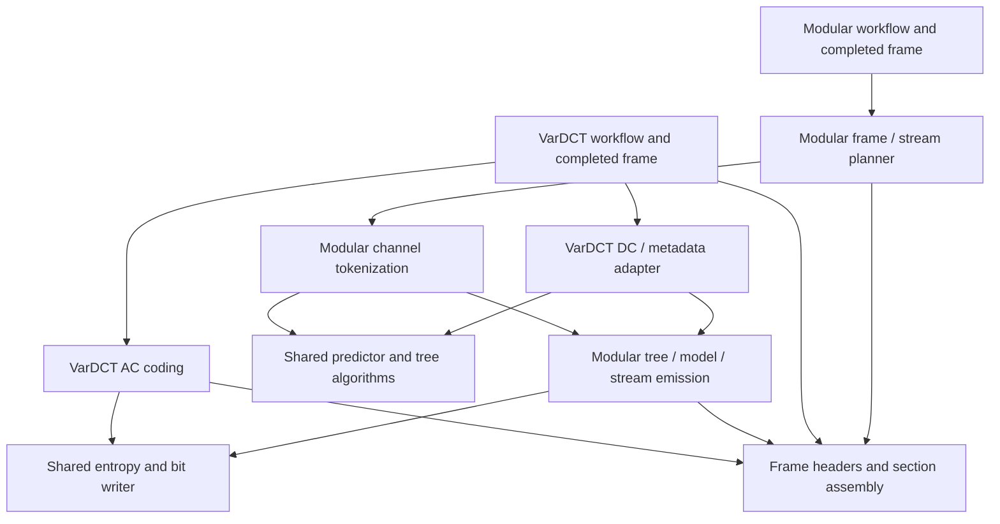

# Modular architecture and implementation plan

Status: Phase 1 extraction implemented; see the
[qualification record and platform limits](modular-phase1/README.md).
[P2.0 foundations and independent reference infrastructure](modular-p2.0.md),
the [P2.1 private RGB8 CPU encoder](modular-p2.1.md),
and [P2.2 integer formats and alpha preservation](modular-p2.2.md) are implemented.
P2.3 onward remains a proposed implementation sequence. Whole-image Modular
encoding is available internally; public API and CLI integration remain P2.5. Originally written
2026-10-07 against GJXL
`67caa6d89830f6a13c057923e34f80753a161e9d` and pinned libjxl
`e8ff09762481785938d8e4e01333ed3917571161`.

The work has two phases:

1. Extract reusable Modular machinery from the existing VarDCT implementation,
   preserving its encoding behavior, supported interfaces, and resource contracts.
2. Build a native Modular image path: shared representations and format support,
   an independently checked scalar CPU implementation, then CPU compression
   policy and public integration. GPU kernels follow this phase.

The order follows the [initial VarDCT roadmap](codestream.md): explicit profile
and representation contracts, shared coding primitives, independently checked
CPU stages, complete pinned-decoder conformance, and then public integration.

## Architectural decision

Modular has two roles: a complete image coding mode and the integer-stream codec
used for portions of VarDCT frames. GJXL will represent those roles separately.
A VarDCT frame adapter will use the same Modular stream machinery as a Modular
image frame adapter. Each mode retains its own frame representation, preparation,
options, and compression policy.

Keep the existing layers: `codec/` owns numerical algorithms and representations;
`codestream/` owns token generation, bitstream syntax, assembly, and encoding
workflows; `core/` owns common values, storage, and execution. Add feature
directories within those layers. Keep the existing GPU backend organization.

The useful libjxl precedent is its separation of
[`modular/`](../third_party/libjxl/lib/jxl/modular/encoding/enc_encoding.h) from
[`ModularFrameEncoder`](../third_party/libjxl/lib/jxl/enc_modular.h).
The latter connects reusable Modular coding to image channels, VarDCT DC,
AC metadata, and raw quantization tables. Its
[`stream identifiers`](../third_party/libjxl/lib/jxl/dec_modular.h) distinguish
these roles. GJXL should make the adapter boundary explicit without importing
libjxl's broad pass-state dependencies or matching its mostly flat VarDCT layout.

### Extraction boundaries

| Current code | Reusable mechanism | Responsibility that stays with VarDCT |
| --- | --- | --- |
| [`modular/prediction.h`](../src/codec/modular/prediction.h) (formerly `weighted_dc_predictor_internal.h`) | Default weighted-predictor arithmetic and state | Prediction-aware DC quantization and its decisions |
| [`dc_group.cpp`](../src/codestream/vardct/dc_group.cpp), [`weighted_dc.cpp`](../src/codestream/vardct/weighted_dc.cpp) | Neighbor handling, predictor reset, residual packing, channel tokenization | Y/X/B traversal, DC group geometry, metadata packing, fixed context selection |
| [`dc_context_tree.cpp`](../src/codestream/vardct/dc_context_tree.cpp) | Tree representation and serialization inputs | Size-adaptive DC trees, metadata/DC leaf numbering, thresholds and defaults |
| [`vardct/headers.cpp`](../src/codestream/vardct/headers.cpp) | Primitive field writing and Modular tree/model emission | VarDCT quantizer, block contexts, coefficient orders and current profile defaults |
| [`entropy.h`](../src/codestream/entropy.h), ANS/Huffman/context-map sources | Integer tokens, HybridUint, model construction and entropy emission | VarDCT candidate searches and effort-to-policy mapping |
| [`sections.h`](../src/codestream/sections.h) | TOC size coding, padding and concatenation | Deciding which payloads occupy which frame sections |

Important existing constraints:

- The weighted predictor is already used by both `codec/vardct/dc_quantization.cpp`
  and the serializer. Extract it below both callers, preserving each allocation
  owner. Moving it into `codestream/` would reverse the codec dependency.
- `WriteSimpleDcGroupModularHeader` writes a VarDCT precision field before the
  Modular header. The AC-metadata counterpart writes an anchor count first.
  Those prefixes belong to the adapters, not a generic Modular stream header.
- `WriteContextTree` patches a split using the DC-group count. That patch is
  VarDCT stream policy; generic tree serialization must accept already resolved
  tree data without knowing the number of DC groups.
- `WriteSimpleCodestreamHeader` hardcodes float32 linear-sRGB/XYB metadata;
  `WriteSimpleFrameHeader` hardcodes the VarDCT mode. Neither is already a
  general-purpose header writer.
- [`FrameGeometry`](../src/core/frame_geometry.h) embeds a DCT block grid.
  [`VarDctEncoderFrame`](../src/codec/vardct_frame.h) and
  [`SimpleVarDctCodestreamProfile`](../src/codec/codestream.h) also describe
  VarDCT specifically. Keep those contracts intact.
- Several affected headers are installed interfaces. Follow the explicit
  [`installed-header manifest`](../cmake/InstalledHeaders.cmake), including its
  support dependencies, rather than assuming `src/` is private.

### Target organization

This is the intended ownership map. New Modular code uses these directories
immediately. Existing implementations move in focused changes as their boundaries
are extracted; completing Phase 1 does not require relocating every VarDCT file.

```text
src/
  core/                           common views, resources, execution, status
  codec/
    frame_metadata.*              common serialization-critical value types
    vardct/                       DCT, quantization, strategy, VarDCT frame
    modular/
      image.*                     owned integer channels and borrowed views
      prediction.*                predictor arithmetic and state
      tree.*                      tree data, properties and evaluation
      tree_learning.*             CPU encoder policy
      transform/                  RCT, palette, squeeze and inverse references
      frame.*                     completed Modular image representation
      *_storage_plan.*            algorithm and representation bounds
    ...                           shared color/perceptual utilities
  codestream/
    bit_writer.*                  shared bit emission
    headers.*                     common image/frame syntax
    sections.*                    shared TOC/padding/concatenation
    entropy/                      ANS, Huffman, HybridUint, context maps
    vardct/
      dc_group.*                  DC and AC-metadata adapters
      dc_context_tree.*           current fixed/adaptive DC policy
      headers.*                   VarDCT-specific fields
      encoder.*, workflow.*       existing VarDCT orchestration and policy
      ...                         AC tokens, orders, rate/storage planning
    modular/
      stream_types.*              stream headers and frame-facing identifiers
      tree_codec.*                tree tokens and bitstream syntax
      tokenization.*              channel scans producing entropy tokens
      stream_encoder.*            reusable stream/global model emission
      frame_encoder.*             whole-image Modular section assembly
      workflow.*                  Modular preparation and CPU dispatch
      *_storage_plan.*            stream, serializer and workflow bounds
  gpu/
    ops/, metal/, cuda/           existing organization; kernels added later
```

Keep `gjxl::core`, `gjxl::codec`, and `gjxl::codestream` and their current package
components. Source grouping does not require new exported libraries. Introduce
private build targets only if dependency enforcement or build time justifies
them. Shared entropy implementations can initially keep their current paths.



Arrows indicate use or contribution. The layering rules are:

- `codec/modular` depends on common core utilities, never on a VarDCT frame,
  codestream writer, GPU backend, or libjxl runtime.
- `codestream/modular` uses codec algorithms and shared entropy/format utilities.
  It never imports VarDCT quantizers, strategies, coefficient orders, or workflow
  options. It may know a stream's frame role at the integration boundary.
- VarDCT adapters can use Modular machinery. The generic Modular machinery
  cannot call back into VarDCT policy.
- Workflow dispatch occurs above both modes. Existing VarDCT APIs remain usable
  without constructing a universal frame or an options object for both modes.
- Production libraries have no libjxl dependency. Reference adapters remain in
  test/benchmark targets, with the original attribution retained for adapted code.

### Representation and API contracts

Names below are provisional internal names, not newly installed interfaces.

| Contract | Contents and ownership |
| --- | --- |
| `ModularChannelView` | Borrowed integer samples, extent, stride, shifts and channel role; no implicit three-channel or block-padding assumption |
| `ModularImage` | Managed owned channels, metadata-channel count and ordered transform descriptors; channels may differ in size after transforms |
| `ModularTree` | Explicit nodes/leaves, predictor IDs, offsets, multipliers and property decisions; separate validation and encoder tree-selection policy |
| `ModularStreamHeader` | Global/local tree selection, weighted-predictor parameters and transforms for that stream |
| `ModularStreamPlan` | Frame role, canonical stream/group identity, pass, channel slices, header and model scope; no pixel ownership |
| `PreparedModularStreams` | Managed tokens, prepared tree/model information and borrowed stream views for serialization; retain backing owners through last use |
| `ModularEncoderFrame` | Immutable completed image/transform representation plus validated serialization-critical metadata; no DCT state or serializer search scratch |
| `ModularEncodingOptions` | Lossless compression effort/policy and execution settings; no AQ distance, quantizer or coefficient-order fields |

Keep token generation separate from model construction and bit emission. The
existing DC fast path can produce `EntropyTokenStreamView` data directly; it
does not need to materialize a generic image or traverse an interpreted tree
for every sample. The shared stream writer accepts prepared tokens and explicit
model/header information. The full-image path adds general channel tokenization.
Both routes must agree on predictor state, properties, tree context numbering,
and the emitted header.

Predictor/tree algorithms expose ordinary values and state; token wrapping and
entropy types live in `codestream/`. Any shared scan helper must permit inlined
specialization or a typed sink without introducing a virtual call per sample.
Select specializations outside the pixel loop.

A frame-level model preparation step owns a global tree and shared histograms
when selected. Encoding a stream references that prepared model; it does not
rebuild or copy a model for every group. Local-tree support has an explicit scope.
Keep stream identity separate from its TOC section position: multiple streams
can contribute to a section, and stream IDs participate in tree properties.

Common header support will use explicit image metadata and a frame encoding
discriminator with mode-specific fields. VarDCT adapters translate the existing
profile without changing its meaning. Modular input is described in source
sample space, including bit depth, color encoding and extra-channel metadata.
The common format layer writes syntax; it does not choose compression settings.
Common serialization-critical value types belong in `codec/frame_metadata.h`,
without bit-writer or entropy dependencies. Completed frames retain those values;
`codestream/headers.*` consumes them. A completed frame must not acquire an upward
dependency on the writer merely to retain its metadata.

### Resources and execution

Use the existing `ExecutionDomain`, managed allocation classes, worker admission,
and publication machinery. A null domain continues to select the shared default.
Classify backing by its owner: input, preparation, completed frame, serializer,
retained result or diagnostics. A new coding mode alone does not require a new
resource class.

Each new component arrives with checked, allocation-free-on-success storage
planning and failure-atomic outputs. Compose a complete Modular workflow bound
before allocating managed input or work buffers. Account for:

- channel descriptors, planes and transform replacement overlap;
- tree-training samples, candidate trees and temporary model searches;
- group views, all retained token arrays and entropy-model backing;
- per-participant predictor rows, worker/status records and diagnostic buffers;
- section writers, final assembly, and internal/public output-copy overlap.

Cap training samples, tree nodes, contexts, transform candidates and concurrent
groups through resolved policy before admission. Data-dependent decisions must
fit those bounds. Measure phase lifetimes explicitly; neither a fitted
bytes-per-pixel estimate nor a component token plan establishes complete-call
admission. A resource-plan overrun remains fatal and cannot be treated as a
compression candidate that merely lost a search.

Borrowed views cannot outlive their owners. Avoid cloning channels merely to
adapt the old DC path. A first CPU implementation may retain a full transformed
image for clarity, provided its peak, replacement overlap and maximum supported
request are planned and tested. Streaming storage is a later optimization.

Use the existing [worker orchestration](worker-orchestration.md) for independent
groups. Finish and join all work before publication or error return; maintain
deterministic ordering of statuses and output. Predictor dependencies inside a
channel remain explicit. Initial scalar execution requires no new worker pool.

Relevant existing contracts are [public admission](resident-public-admission.md),
[publication accounting](resident-publication-accounting.md),
[CPU workflow planning](resident-cpu-workflow-storage-planning.md), and
[planning recipes](planning-recipes.md).

## Phase 1: extract the existing Modular subset

Phase 1 is a behavior-preserving extraction. It does not enable Modular image
encoding or alter DC prediction, quantization, smoothing, tree policy, entropy
search, effort defaults, GPU kernels, or backend selection.

### P1.0: freeze the baseline and identify owners

Before the first implementation change:

- Retain an isolated baseline build and record source revision, compiler,
  configuration, enabled backends and pinned decoder revision.
- Capture representative complete codestreams, DC/metadata token streams,
  selected tree layouts, entropy decisions and storage-plan outputs.
- Cover weighted and gradient prediction; the 1/2/4/34-leaf DC tree policies;
  low/high efforts and entropy modes; ordinary and prediction-aware DC
  quantization; custom coefficient orders/context maps; compact/sparse frames;
  single/multiple DC groups; and rate-control attempts where relevant.
- Map every allocation and retained view crossing the proposed boundaries.
  Preserve the shared DC/metadata entropy-model scope and all current parallel
  scheduling. Include installed headers and GPU host-side callers in this map.
- Establish paired timing baselines for DC tokenization, serialization and
  complete encoding, including small images and photographic multi-group images.
  Record noise and acceptance thresholds before using timings to judge changes.

Deliverable: a reproducible baseline manifest and focused comparison harness.
Reuse existing fixtures and conformance tools. Add coverage for missing boundary
cases rather than replacing existing tests with restatements of the new code.

### P1.1: extract predictor mechanics below both callers

Move the reusable default weighted predictor to `codec/modular/`, retaining
its exact arithmetic, update order, reset behavior, neighbor conventions,
overflow checks and resource-owner parameter. Factor gradient/neighbor helpers
only where their contracts actually match.

Keep `VarDctDcPrediction`, its defaults and compatibility include paths. Explicit
adapters map it to the internal Modular predictor choice. Prediction-aware DC
quantization remains in VarDCT, including its lossy decisions and reconstructed
DC output. The extracted predictor initially supports precisely the current
default weighted parameters; broader parameter support belongs to Phase 2.

Gate: existing weighted-predictor and pinned DC-processing oracle tests pass;
DC coefficients, reconstructed values and residual tokens match the baseline;
codec and serializer scratch remain charged to their original owners.

### P1.2: separate stream syntax from VarDCT prefixes and policy

Introduce the minimal Modular stream/header types and tree/model emission
helpers required by current streams. Extract the common header suffix from the
DC and metadata writers. Keep extra DC precision and transform-anchor count
emission in `codestream/vardct/` adapters.

Split Modular tree/model emission from `WriteDcGlobalWithLayout`. Retain the
DC-group-dependent tree patch, leaf layout selection and fixed context tables
with VarDCT policy. Generic helpers consume resolved tree tokens/data and model
information. Preserve tree token order, context numbering, symbol encodings,
bit alignment and the distinction between global information and each stream.

Keep the current no-transform/global-tree/default-WP subset explicit. Unknown
transform or tree modes must fail validation instead of silently writing the
old four-bit header. Phase 1 need not implement arbitrary learned trees just
to serialize the existing fixed tree.

Gate: extracted headers and tree/model output are bit-identical; tests verify
both adapter prefixes separately from the Modular suffix. Failed validation
leaves destination writers unchanged under the existing atomicity contracts.

### P1.3: route existing DC and metadata through the extracted boundary

Make the existing DC/metadata producer an explicit VarDCT adapter. Preserve its
specialized loops, Y/X/B order, metadata channel shapes and predictor resets.
Reuse extracted arithmetic and common stream emission. Keep the current tree
context mapping and DC integer-mapping search in VarDCT policy.

Use borrowed channel/token views at the boundary. Keep prepared global models
shared across the same streams as before. Do not introduce per-group model
rebuilding, an additional whole-frame channel copy, or per-pixel polymorphism.
General-purpose image tokenization is a Phase 2 consumer of this boundary.

Separate genuinely shared entropy helpers from VarDCT orchestration when needed;
some currently sit in `encoder_internal.h`. Keep whole-codestream candidate
ranking, coefficient-order selection and VarDCT effort policy with VarDCT.

Gate: DC and metadata tokens, entropy decisions and complete bytes match the
baseline across the captured matrix. Memory planning and allocation-failure
tests cover both original users of the predictor and the new stream boundary.

### P1.4: close the ownership and compatibility boundary

Group the touched VarDCT implementations under `codec/vardct/` and
`codestream/vardct/` in mechanical changes separate from the extraction logic.
Split common header primitives from VarDCT-specific header code while retaining
the old functions and their default bit output. Leave unrelated DCT, AQ, backend,
and entropy file moves for focused follow-ups if they would obscure review.

Keep existing public include paths and symbols. A moved public header can remain
at its original path or become a forwarding header; install every required
destination/support header explicitly. A compatibility wrapper has no second
implementation. Update source lists, internal includes and affected references.
Avoid changing namespace/type identities or public layouts as a side effect of
relocation. Private new Modular headers stay outside the public manifest unless
an existing public header requires them to compile.

Gate: relocated installed consumers compile in the supported C++20/C++23 modes,
the C header still compiles as C11, and exported target/component names remain
unchanged. Review forbidden dependencies in the new Modular directories.

### Phase 1 completion criteria

- Existing VarDCT workflows use the extracted predictor and stream syntax.
- No generic Modular algorithm depends on VarDCT policy or state.
- Complete encoded bytes match the baseline for the same backend, options and
  inputs; existing CPU/GPU differences are not redefined by this requirement.
- Pinned-decoder conformance, resource-failure recovery, worker joining, installed
  consumers and the existing applicable regression suite pass. Reproduced
  baseline failures are reported separately with evidence.
- Storage bounds remain equal where ownership is unchanged. Any necessary
  structural overhead is itemized and validated; no unexplained reservation
  growth or new channel/token copy is accepted as incidental refactoring.
- Paired measurements establish that extraction has not introduced a material
  regression under the predeclared timing criteria.

This is a useful stopping point: VarDCT remains the only image mode, but its
embedded Modular subset has explicit, reusable ownership.

## Phase 2: native Modular image encoding and the CPU oracle

The first supported image mode is lossless Modular. Modular also supports lossy
use cases, but these require separate quantization and fidelity policy; their
presence in the format does not make them part of this implementation phase.

### Planned support boundary

| Dimension | First complete vertical slice | Phase 2 completion target |
| --- | --- | --- |
| Source | RGB8 in sRGB sample space | Gray, RGB and unassociated RGBA, each at 8 or 16 unsigned bits |
| Fidelity | Every source sample preserved | Exact source samples, including RGB under zero alpha |
| Frame | One regular final frame, raw codestream | Same; no container, animation or image streaming |
| Color metadata | sRGB; no XYB conversion | sRGB or corresponding grayscale encoding; explicit integer and alpha metadata |
| Groups | Fixed 256-pixel group dimension | Same initially, with clipped edges and transformed-channel shifts |
| Passes | One | One; responsive/progressive output deferred |
| Prediction/tree | Gradient and a small predefined global tree | CPU predictor set, predefined trees and bounded deterministic tree learning |
| Transforms | Identity | Qualified reversible color, palette and single-pass squeeze paths |
| Entropy | Existing prefix/ANS and HybridUint | Shared mechanisms with independently resolved Modular compression policy |
| LZ77 | Disabled | Deferred; no requirement for lossless format correctness |
| Execution | Scalar CPU | Scalar oracle plus admitted CPU group parallelism |

Palette and squeeze are separate final CPU capabilities, each disabled until
its own gate passes. Their automatic use requires evidence of useful compression
cost, not just a correct transform. Public support claims enumerate the actual
qualified subset. The first vertical slice can be exercised internally while
later Phase 2 milestones are in progress.

Deferred features include other extra-channel types, arbitrary ICC input,
floating-point bit-pattern preservation, other integer depths, lossy Modular,
responsive/multipass coding, containers, a native production decoder and GPU
kernels. Adding alpha to VarDCT frames is a later consumer of the stream layer,
not an implicit Phase 2 change to the existing VarDCT profile. Raw quantization
table support likewise remains an extension point.

### P2.0: shared metadata, channels, grouping and oracle infrastructure

Implemented and qualified on the recorded Windows configuration; see the
[P2.0 contracts, reproduction instructions and results](modular-p2.0.md).

Implement the non-VarDCT image/channel representation and mode-aware header
contracts. Use signed integer channel storage with sufficiently wide intermediate
arithmetic. For the advertised 8/16-bit inputs, prove the ranges through each
enabled transform and predictor. Define exact signed shifts, rounding and
format-required arithmetic; do not rely on undefined signed overflow or silently
narrow predictor residuals. Optional transform candidates that cannot satisfy
the numeric contract must leave a valid identity candidate available.

Introduce a checked `ModularFrameGeometry`/stream planner based on source extents
and channel shifts, independent of DCT padding. The planner resolves the exact
placement of global/meta channels and grouped channels, canonical stream IDs,
DC-group/pass-group participation, and TOC sections. JPEG XL's DC/AC section
names also appear in Modular-only frames; they do not imply DCT coefficients.
Follow the pinned frame/Modular implementation for small-image global storage,
empty payloads and the single-group section-assembly special case. Do not assume
one channel, one stream and one TOC entry have a one-to-one relationship.

Parameterize common image/frame syntax and keep the old VarDCT header functions
as compatibility adapters. Separate common primitive fields from mode-specific
payloads. Encode integer bit depth, source color and loop-filter settings
appropriate to exact lossless decoding; do not reuse XYB/filter defaults from
the VarDCT profile. Reuse TOC/padding mechanisms after verifying their call-site
assumptions for Modular.

Establish the test-only pinned libjxl harness before general tokenization:

- Call the pinned predictor/tree/transform functions for controlled inputs and
  identical options. Keep this adapter independent of GJXL's implementation.
- Decode complete native outputs through the pinned decoder API into exact
  integer buffers; inspect dimensions, bit depth, frame mode and extra channels.
- Request the encoded source color space and preserve unassociated alpha and
  invisible colors. Disable output conversions that would invalidate an exact
  sample comparison. Test alpha separately if the output API requires it.
- Extend the existing reference-build approach and revision check. Reference
  libraries or executables must not become dependencies of installed targets.

Gate: channel/geometry/storage contracts pass boundary and overflow tests; common
header changes preserve all Phase 1 VarDCT bytes; pinned reference calls and an
integer round-trip harness are operational. A float/PFM comparison is insufficient
for this lossless contract.

### P2.1: the smallest independently decodable CPU encoder

Implemented as a private RGB8 workflow; see the
[P2.1 contracts, reproduction instructions and results](modular-p2.1.md).
The resolved baseline uses one gradient leaf (offset zero, multiplier one),
prefix coding by default and explicitly selected ANS, with one CPU participant.
The identity/gradient RGB8 range proof permits the 16-bit-buffer declaration;
other metadata paths retain the conservative P2.0 declaration.

Build a complete RGB8 path using no transforms, gradient prediction, a bounded
predefined global tree, existing entropy coding and the fixed group size. Use
the original integer samples directly; no linearization, XYB, AQ, resampling,
DC quantization, Gaborish or EPF is part of this path.

The sequence is:

```text
validate integer input and options
  -> resolve supported profile and checked storage plan
  -> admit complete workflow
  -> prepare integer channels and stream layout
  -> tokenize with the selected tree and predictor
  -> prepare shared tree/histogram information
  -> write global data and individual stream payloads
  -> write frame sections and publish output atomically
```

The general tokenizer implements the actual Modular boundary rules, channel
ordering, static properties, predictor resets and context numbering. Empty
streams and channels handled globally must not be accidentally tokenized twice.
Tree serialization and entropy emission reuse the Phase 1 boundary.

Gate: pinned decoding reconstructs every RGB8 sample exactly for single- and
multi-group images, including images crossing DC-group boundaries. Fixed-choice
tokens and tree information agree with the pinned oracle. CPU-only builds pass,
and unsupported requests fail before caller-visible output changes. Complete
admission and publication accounting are present in this first workflow.

### P2.2: preserve more source formats and extra-channel semantics

Implemented in the private scalar workflow; see the
[P2.2 input contract and qualification record](modular-p2.2.md).
`PackedModularImageView` selects Gray/RGB/unassociated RGBA at 8 or 16 bits,
with a bounded byte span, explicit byte stride, and little-/big-endian sample
order (default little-endian; ignored at 8 bits). Unaligned samples and odd
strides are supported. `ResolveModularInput` supplies the allocation-free shared
metadata/channel description for validation, preparation and storage planning.
`EncodeModularImage[Owned]` uses the original admission/publication workflow;
the RGB8 entry points remain forwarding adapters with identical output.

Channels remain full-resolution signed 32-bit planes holding unsigned source
values. Gray uses one color plane; RGBA uses three color planes followed by one
same-depth, unassociated alpha plane. `TokenizeIdentity` applies the existing
gradient leaf separately to every channel and stream. No transform, alpha
optimization or association conversion is applied. All 8-bit identity inputs
retain the signed-16-buffer sufficiency proof; 16-bit inputs clear that flag and
preserve the complete unsigned range. Public APIs and CLI remain P2.5.

Add grayscale, 16-bit integer input and RGBA in separate changes. Specify byte
order and row stride for packed 16-bit input, validate buffer lengths with checked
arithmetic, and reuse common layout validation without imposing VarDCT's opaque-
alpha restriction. Preserve integer values through preparation and transform
input. A 16-bit path must accept its complete advertised sample range.

Model alpha as an extra channel with its own bit depth and association metadata.
Preserve RGB at alpha zero; do not apply invisible-pixel optimization or
premultiplication. Ensure color-channel transforms do not accidentally treat
alpha as a color component. Keep alpha/color channel mapping explicit in both
the stream planner and decoded comparison.

Gate: exact integer round trips for all advertised formats, including max/min
values, high-byte differences, non-opaque alpha, transparent colored pixels,
nontrivial strides and invalid buffer layouts. Metadata and component counts
match the request. Original VarDCT validation and output remain unchanged.

### P2.3: scalar prediction, reversible color and tree/model policy

Extend the scalar implementation to the JPEG XL predictor choices needed by the
planned encoder and then qualify the remaining predictor IDs as explicit CPU
capabilities. Add weighted-header parameter handling separately from the fixed
default extracted in Phase 1. Compare predictions, properties, state updates
and residuals exactly against the pinned implementation at channel/group edges.

Add reversible color transforms, starting with a single documented RCT choice
and its inverse, then a bounded candidate set. Keep the global color-space
metadata separate from the reversible transform recorded inside Modular.

Extend the tree representation/codec to general validated nodes and leaves,
including predictor offsets and multipliers. Add deterministic tree learning
only after prescribed-tree tokenization works. Bound samples/nodes/contexts;
freeze sampling seeds, sample traversal, split tie-breaking and leaf numbering.
Learn or select the global tree before parallel group tokenization. Merge token
populations in canonical order before finalizing shared entropy models. Local
tree/model support is added explicitly and remains bounded by the same resolved
policy.

Audit existing entropy assumptions: valid residual/token range, maximum contexts,
context-map index width, cluster/alphabet limits, shared model scopes, singleton
models and no-LZ77 signaling. Reuse mechanisms while giving Modular its own
effort/search policy. Training and candidate evaluation must count tree headers,
transforms, model overhead, token bits, padding and section sizes where relevant.
Compare a final candidate with the supported simpler baseline and use stable
ties; include candidate overlap in the workflow plan.

Gate: prescribed transformations, predictors and trees match the reference
exactly; learned outputs decode exactly and are deterministic. Compression
choices are evaluated by complete output size and timing. Matching libjxl's
heuristic choices or compressed bytes is not a requirement.

### P2.4: palette and squeeze as separate CPU milestones

Implement and qualify palette before squeeze. Each transform needs:

- an explicit descriptor, validation and metadata/channel-shape application;
- forward arithmetic and a scalar inverse/reference path;
- correct descriptor serialization and inverse ordering;
- managed storage bounds for metadata channels, output and replacement overlap;
- prescribed-choice differential tests and complete pinned-decoder tests.

For palette, start with exact palettes and deterministic palette ordering. Cover
one-color, small-color-set and palette-size-limit cases, including RGBA. Preserve
all samples and keep lossy palette behavior disabled. Validate the ordering of
palette metadata channels relative to the remaining image channels.

For squeeze, implement and qualify odd dimensions, horizontal/vertical splits,
residual-channel ordering, shift propagation and inverse arithmetic. Revisit
stream placement after every transform that changes channel dimensions; do not
reuse the untransformed group/channel list. Qualify single-pass output before
any future responsive policy. Test the combination of transforms as well as
each transform independently.

Keep transform search policy separate from the transform implementation. Start
with forced-choice tests, then enable a bounded selector that can retain identity
or RCT-only output when palette/squeeze costs more. Avoid expanding the first
implementation into libjxl's full transform-search heuristic set.

Gate: transformed channels match prescribed-choice references, native inverses
restore exact samples, and independently decoded complete files preserve those
samples. Invalid transform descriptors, excessive ranges, and failed candidate
allocations cannot leave partially changed images or published output.

### P2.5: CPU scheduling, API and tooling integration

Keep the serial implementation callable as the CPU oracle. Add admitted CPU
parallelism over independent streams/groups using fixed model data and
participant-local predictor state. Global training, model merging and output
assembly use canonical order, so worker completion order does not change bytes.
Account for simultaneous scratch and retained group outputs. Preserve the
existing launch-failure, join and status propagation contracts.

Add a mode-specific C++ entry point such as `EncodeModularImage`, together with
`ModularEncodingOptions` and a mode-appropriate summary. Share execution-domain,
output-publication and timing mechanisms rather than reusing
`VarDctEncodingOptions` or populating unused VarDCT summary fields.

For C, prefer a separate sized Modular options structure and encoding entry
point that reuse the existing context, image view and buffer ownership contract.
Finalize names/layouts only after the native CPU contract is stable. Add pixel
format values for supported grayscale/16-bit input without changing existing
enum values or sized-structure prefix behavior. Update Rust FFI and safe wrappers
in the same integration milestone. Keep new internal algorithm types private
unless a deliberate low-level C++ API is warranted.

Dispatch must happen before the current packed-sRGB-to-linear-float conversion.
Split common memory-layout validation from per-mode capability validation:
non-opaque RGBA can be valid for Modular while remaining unsupported by the
existing VarDCT profile. Keep an explicit lossless Modular request distinct from
VarDCT distance/quality settings; an old quality setting must not silently change
codec or gain a new bit-exactness promise.

Phase 2 automatic Modular execution resolves to CPU. A forced Metal/CUDA request
reports unsupported/unavailable capability according to the existing error
conventions; it cannot silently select VarDCT or claim a GPU execution. Existing
VarDCT dispatch remains independent.

The current native CLI reads PFM. Add an exact integer input route before exposing
lossless CLI usage. A small PGM/PPM/PAM reader can cover the planned formats without
requiring a new production image-library dependency; specify 16-bit file byte
order and channel semantics. Any normal-image wrapper used for this mode must
preserve samples/alpha instead of converting through its existing linear-float
route. Unsupported source color profiles require an explicit rejection rather
than relabeling their samples as sRGB.

Update the installed-header manifest, relocated consumer fixtures, CLI help,
C/Rust documentation and examples. Keep the existing VarDCT batch API unchanged;
mixed-mode batch generalization can follow when there is a caller for it. Modular
requests can already share one execution domain with concurrent VarDCT requests.

Gate: all advertised formats work through the supported entry points; old C
prefixes and C++ include paths still work; outputs remain atomic; concurrent
mixed-mode calls honor one domain's memory and CPU caps. Exact serial/parallel
bytes match for the same resolved policy.

### P2.6: freeze the CPU oracle and establish GPU work boundaries

Retain a scalar path with controlled transforms, tree, predictor and entropy
settings. Add fixtures at stage boundaries: transformed channels, tree decisions,
prediction/property values, residual/context tokens, populations, stream bit
counts and final files. Record the native and pinned-reference revisions and
all resolved settings with fixture provenance.

Profile complete calls as well as input preparation, transforms, model training,
tokenization, entropy coding and assembly. Use small images, photographic images,
screen content, palettes, noisy inputs, 16-bit data and alpha. Measure latency,
throughput, encoded size, managed memory peak and planned capacity separately.
Compare selected same-effort workloads with pinned libjxl for context; do not
equate effort numbers or require its heuristic decisions.

Keep arithmetic truth separate from policy and performance baselines. Native
CPU output is the future GPU oracle for a prescribed input/decision set; pinned
libjxl remains an independent check on that native implementation. An optimized
CPU implementation cannot be its own sole reference.

Phase 2 completes when the support table is implemented and qualified, the CPU
path works without GPU support or a libjxl runtime dependency, and regression,
resource, installed-interface and independent decoding gates pass. Retain an
explicit capability list and baseline corpus for the following GPU phase.

## Validation and evidence

### Equality requirements

| Comparison | Required equality |
| --- | --- |
| Phase 1 before/after, identical route and options | Complete bytes, tokens, selected policy and decoded output; separately audited storage bounds |
| Scalar native vs pinned reference, identical predictor/transform/tree inputs | Exact integer results, state/property decisions and residual/context tokens |
| Native lossless encode vs pinned decode | Every integer source sample and relevant metadata, including invisible RGB and alpha |
| Native serial vs parallel, identical resolved policy | Exact stage results and complete bytes |
| Native vs libjxl independently selected compression heuristics | Exact decoded samples; compressed-byte equality is not expected |
| Future GPU kernel vs frozen scalar path | Exact integer stage outputs for fixed inputs/decisions before allowing policy differences |

A local forward/inverse round trip is useful but insufficient: paired mistakes
can cancel. Likewise, final decoding alone may hide incorrect stage behavior
that another stage happens to compensate for. Use both independent stage checks
and complete-file decoding. For arbitrary learned trees, validate the native
tree through the pinned decoder or compare prescribed-tree execution, rather
than pretending two unrelated learners should produce identical trees.

### Coverage matrix

| Area | Required cases |
| --- | --- |
| Geometry | 1x1, one row/column, odd sizes, clipped edges, 255/256/257 and 2047/2048/2049 boundaries, multi-group images, shifted channels |
| Samples | Zero, maximum, ramps, impulses, checkerboards, random noise, high-bit-only changes, signed transform extrema, synthetic metadata channels |
| Input views | Nonzero offsets, padded strides, checked lengths, invalid dimensions/formats, source unchanged after success/failure |
| Alpha | Opaque, fractional, zero with nonzero RGB, independent color/alpha patterns, 8/16-bit association metadata |
| Prediction | All enabled IDs/parameters; first pixel/row/column; channel/group reset; weighted error-state boundaries |
| Trees/models | Constant/single-leaf and split trees, predictor offsets/multipliers, global/local scopes, context limits, invalid nodes, deterministic training |
| Transforms | Identity, forced RCTs, constant/limited palettes, squeeze odd sizes/shifts, mixed transform order and exact inverse |
| Bitstream | Global/group placement, empty payloads, single-group special case, prefix/ANS, HybridUint extremes, TOC selector/alignment boundaries |
| Resources | Too-small admission, overflow, planned-vs-observed capacity, typed plan overrun, allocation failure at each owner, old/new output overlap, recovery |
| Concurrency | Serial/parallel parity, worker-launch failure, ordered errors, all workers joined, simultaneous Modular/VarDCT calls in one domain |
| Packaging | CPU-only and enabled-backend builds, installed C/C++ consumers, Rust wrappers, no production libjxl linkage |

Use the existing DC, tree, entropy, sections, serializer/storage and workflow
tests as regression anchors. Relevant starting points include
[`weighted_dc_test.cpp`](../tests/weighted_dc_test.cpp),
[`dc_processing_oracle_test.cpp`](../tests/dc_processing_oracle_test.cpp),
[`dc_group_test.cpp`](../tests/dc_group_test.cpp),
[`dc_context_tree_test.cpp`](../tests/dc_context_tree_test.cpp),
[`codestream_encoder_test.cpp`](../tests/codestream_encoder_test.cpp), and
[`codestream_conformance_test.cpp`](../tests/codestream_conformance_test.cpp).
Add dedicated Modular tests for new semantics and a separate integer conformance
harness. Do not replace the existing VarDCT float conformance checks.

Qualification records should contain exact build/test commands, source/tool
revisions, resolved profiles, fixture hashes and retained failures. Run sanitizer
coverage for integer arithmetic, bounds and ownership on supported toolchains,
and exercise representative x86-64 and ARM64 CPU builds. GPU-enabled regression
checks require the appropriate hardware; unrun configurations remain explicitly
unqualified. Phase 1 results are recorded in the
[qualification report](modular-phase1/README.md). Phase 2 results are recorded
for [P2.0](modular-p2.0.md), [P2.1](modular-p2.1.md) and
[P2.2](modular-p2.2.md); later milestones remain
planned.

### Compression and performance gates

Correctness is unconditional for the advertised profile. Rate and speed claims
require a representative corpus and repeated measurements with recorded policy.
Keep transform/tree-search comparisons inclusive of their extra preparation,
model and allocation cost. Distinguish cold and warm runs and complete-call
latency from summed worker time. A stage speedup alone is not evidence of a
faster workflow or improved concurrent throughput.

Phase 1 should preserve existing performance within the baseline-derived noise
and regression criteria. Phase 2 first establishes a correct CPU baseline;
compression heuristics then justify their own cost. No unsupported claim of
libjxl rate/speed parity is an exit criterion.

## Implementation order and review units

| Order | Reviewable deliverable | Depends on |
| --- | --- | --- |
| P1.0 | Baseline, owner map and reproducible comparisons | Current implementation |
| P1.1 | Shared predictor extraction with existing callers | P1.0 |
| P1.2 | Shared Modular header/tree/model syntax | P1.1 |
| P1.3 | VarDCT adapters using the stream boundary | P1.2 |
| P1.4 | Focused organization, compatibility and Phase 1 qualification | P1.3 |
| P2.0 | Channels, metadata, geometry, resource recipes and pinned oracle harness | Phase 1 |
| P2.1 | Lossless RGB8 scalar vertical slice | P2.0 |
| P2.2 | Gray/16-bit/RGBA source and metadata support | P2.1 |
| P2.3 | CPU predictors, RCT and bounded tree/model policy | P2.2 |
| P2.4a | Exact palette support and qualification | P2.3 |
| P2.4b | Single-pass squeeze support and qualification | P2.4a |
| P2.5 | CPU parallelism, C++/C/Rust/CLI integration and packaging | Qualified CPU capabilities |
| P2.6 | Frozen native oracle, corpus, stage profiles and GPU handoff | P2.0 through P2.5 |

Each row may span several small changes. Keep mechanical moves, semantic
extensions and policy/performance tuning independently reviewable. Add resource
plans and independent checks with each new capability, rather than accumulating
them in the last milestone. Do not update baseline expected bytes to conceal a
Phase 1 behavior change.

## After Phase 2: GPU development prerequisites

GPU work starts from measured CPU stages and immutable representation contracts.
Place operation contracts in `gpu/ops/` and implementations in the existing
Metal/CUDA trees only when a stage is selected for acceleration.

The first kernel boundary must specify input/output layout, legal ranges,
ownership, scratch bounds, synchronization, failure behavior and exact CPU
comparison. Include upload/readback and publication costs in the decision.
Reversible transforms and suitable independent group work are candidates;
prediction and weighted error updates have dependencies that require an explicit
execution strategy. Do not assume a per-pixel parallel mapping preserves them.

Keep tree learning and other host decisions on CPU until profiling justifies
moving them. A GPU implementation initially consumes the same prescribed tree
and transform decisions as the CPU path. Qualify exact results and resource
lifecycle before introducing faster layouts, reduced transfers or new policy.
Backend availability and automatic routing then follow the existing VarDCT
pattern of explicit capability qualification and complete-workflow measurement.

The scalar oracle remains available after GPU integration. Future features first
extend its contract and independent reference coverage before GPU acceleration.
