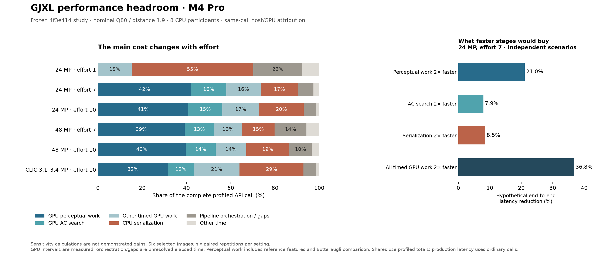

**GJXL performance headroom on the M4 Pro — 21 September 2026**

I would not classify GJXL as having reached this hardware's achievable limit. It is a substantially optimized implementation with different remaining constraints in different parts of the encoder. Some measured kernels already have high occupancy or substantial memory traffic; other costly kernels have much lower occupancy. CPU serialization remains important, especially at low efforts. These observations justify targeted optimization, but they do not establish a percentage of performance left or promise a particular future speedup.

There are three distinct questions: how much faster the current computations can execute while preserving decisions/output; how much work a different encoder policy can avoid at equivalent decoded quality and rate; and how much throughput multiple images can achieve through overlap. Their limits and validation requirements differ.



The left panel uses additive, same-call attribution. The right panel changes one cost at a time mathematically; it does not show implemented improvements.

**Evidence and scope.** The primary timing evidence is the [fresh Q80 study](/Users/yunhocho/GitHub/libjxl-runtime-study-2026-09-03/gjxl-stages-q80-20260921/RESULTS.md): six selected images, efforts 1–10, distance 1.9, eight CPU participants, fully resident Metal, final diagnostic score disabled. Each setting has two warmups per mode and six alternating ordinary/profiled pairs. This investigation independently revalidated all 60 settings and 360 pairs, frozen executable/support-file hashes, the six input hashes, completion-record capture/output hashes, submission equality, and nonoverlapping GPU intervals/additive partitions. See [validation](saved-data-validation.json) and [analysis script](analyze_saved.py).

The frozen source is `4f3e4147c8bde16b0b49523adbf10ddd8043585f`, two profiling-related commits above this checkout's `main`, `b1a7373beff4c0370494c2f9584bcb1510491357`. GPU shader files and `src/codestream/encoder.cpp` are identical between those revisions. The profiling branch has since advanced; this report identifies the frozen measured revision explicitly. Its production-aligned profiling retains the combined ACS/AQ submission and checks ordinary/profiled output and submission equivalence. Older main-branch profiles that split this path are less suitable for this analysis.

The local machine is a 14-core CPU / 20-core GPU Apple M4 Pro with 48 GB memory, macOS 15.6, Xcode Instruments 26.0 (17C529). The study times warm public encoding calls from loaded linear RGB through returned in-memory codestream, including CPU work and publication. Image loading, backend creation, file I/O, and returned-object destruction are outside the boundary. This is selected-image, nominal-setting evidence, not a quality-matched corpus comparison or a cold-start benchmark.

**Where the time goes.** Ordinary latency is the production reference. Shares below use the corresponding profiled total, not ordinary time minus GPU timestamps. Images are equally weighted within the two-image CLIC group.

| Image group / effort | Ordinary mean | Profiled mean | Timed GPU stages | CPU serializer | Pipeline orchestration / gaps |
|---|---:|---:|---:|---:|---:|
| 24 MP / e1 | 129.7 ms | 127.2 ms | 15.3% | 54.9% | 22.2% |
| 24 MP / e7 | 472.5 ms | 464.3 ms | 73.5% | 17.0% | 6.8% |
| 24 MP / e10 | 856.9 ms | 847.6 ms | 72.8% | 20.1% | 5.5% |
| 48 MP / e7 | 1,113.5 ms | 1,104.5 ms | 65.1% | 14.8% | 14.4% |
| 48 MP / e10 | 1,930.8 ms | 1,920.8 ms | 67.0% | 19.4% | 10.2% |
| CLIC 3.09/3.36 MP / e10 | 147.4 ms | 149.0 ms | 64.0% | 28.9% | 5.7% |

The remainder is input preparation and other workflow/publication time. Serializer includes its measured children and residual. Pipeline orchestration/gaps is unresolved elapsed time: it can contain host work, waits, uninstrumented GPU work, and profiling effects. It is not a bucket of removable CPU synchronization. Negative ordinary/profiled offsets reflect perturbation and variability; they do not establish a benefit from profiling. All efforts and groups are in [summary.csv](summary.csv).

At 24 MP/e7, Butteraugli comparison is 148.3 ms and reference features 47.2 ms: together **195.5 ms, or 42.1%** of the profiled call. AC strategy search is 73.7 ms, or 15.9%. At e10 the comparison rises to 298.8 ms and AC search to 129.7 ms. The profiles show repeated perceptual evaluations; source control flow keeps their quantization dependencies on the critical path. Faster execution and fewer evaluations are separate research directions.

The fine 24 MP/e7 GPU totals include 26.9 ms in main-scale Malta, 21.5 ms in distorted main-scale low/medium filtering, 18.6 ms in resident perceptual reduction, 16.7 ms in the DCT32 candidate stage, 15.2 ms in DCT16, and another 10.7 ms in reference main-scale low/medium filtering. Each fine-stage value sums repeated invocations within a sample before averaging. These names have distinct boundaries: the DCT32 stage includes its candidate-loss kernel and cost finalizer. See [fine GPU means](gpu-stage-means.csv).

Low efforts have a very different budget. At 24 MP/e1, DC tokenization and the serializer residual each cost about 20 ms; AC tokenization costs 12.6 ms and section writing 10.1 ms. At high effort the entropy policy also matters: e8+ selects rate-optimized behavior in [workflow.cpp](/Users/yunhocho/GitHub/gjxl/src/codestream/workflow.cpp:1878), and [encoder.cpp](/Users/yunhocho/GitHub/gjxl/src/codestream/encoder.cpp:2180) evaluates balanced/expanded representations with shared immutable tokens and bounded parallel participation. For CLIC/e10, entropy optimization alone is 21.3% of the complete profiled call. This is a concrete CPU target; simply moving the final bit writer to the GPU would address a different boundary.

**New Metal System Trace evidence.** I recorded two bounded traces of the frozen Q80 executable on Alpine Lake 24 MP/e7. Each performed seven calls: one reference, one warmup per mode, and two measured pairs. All returned bytes, summaries, and submission counts matched within each capture. The first used the standard template. The second enabled Performance Limiters and Shader Timeline, retaining the default GPU performance state. Exact commands, output, raw trace packages, the saved template, and exports are under [the ordinary trace directory](trace-24mp-e7/) and [the counter trace directory](trace-counters-24mp-e7/).

Counter analysis uses only the two measured **ordinary** calls. Their eight command buffers are identified by the harness's checked call order and the exported submission table. Of 706.6 ms of visible GJXL GPU-active intervals, 44.5 ms overlapped visible GPU work from other processes and was excluded, leaving 662.1 ms. Counters are device-wide, not process-specific. Shader-correlated windows also exclude 100 microseconds at each shader-interval edge. Time-weighted integration is cross-checked against direct interval intersections, and input arrays/ranges are validated. See [trace analysis](trace-analysis.json), [counter table](trace-counters.csv), and [parser](analyze_trace.py).

| Observed ordinary shader windows | Usable window duration across two calls | Compute occupancy | F32 utilization | GPU bandwidth |
|---|---:|---:|---:|---:|
| All GJXL GPU-active intervals after exclusion | 662.1 ms | 64.5% | 24.0% | 132.5 GB/s |
| DCT32 candidate loss | 31.6 ms | 24.8% | 36.7% | 22.8 GB/s |
| DCT16 candidate loss | 7.3 ms | 37.0% | 32.5% | 26.9 GB/s |
| Low/medium frequency filter | 15.7 ms | 69.7% | 36.8% | 79.7 GB/s |
| Malta | 2.5 ms | 98.6% | 41.6% | 173.7 GB/s |
| 8×8-block resident L2 reduction | 4.1 ms | 94.8% | 9.7% | 208.8 GB/s |

These are sampled, shader-correlated **windows**, not full per-kernel averages. Coverage is particularly limited for Malta and the 8×8 reduction; they do not represent every invocation or all reduction shapes. Shader intervals can contain temporal uncertainty and same-process overlap. The untrimmed sensitivity is retained separately in `trace-counters-edge0.csv`. This one process/two-call diagnostic identifies leads; it does not qualify a corpus-wide hardware-utilization percentage or a performance gain. The counter-traced ordinary calls took 502.2 and 510.2 ms, versus 472.5 ms in the saved study, so these traces should not replace the ordinary timing cohort.

Several conclusions follow from the counters and source together:

- **The DCT32 candidate kernel is a strong resource-use investigation target.** It shows low occupancy and low external bandwidth despite 52,547 threadgroups on this input, so a globally tiny grid is not the explanation. It launches 384 threads/group and explicitly declares 28 KiB of threadgroup arrays for coefficients, temporary storage, and a basis in [ac_strategy.metal](/Users/yunhocho/GitHub/gjxl/src/gpu/metal/kernels/ac_strategy.metal:1856). Lifetime/storage reuse, work assignment, and synchronization deserve targeted compiler/resource inspection. The trace does not prove which resource caps occupancy or that register spilling occurs.
- **Malta is already highly occupied in the observed windows.** Raising occupancy is consequently a weak isolated objective there. Reducing instructions, repeated stencil/halo work, or traffic could still help, but occupancy alone cannot establish optimality.
- **The resident reduction has a substantial bandwidth component.** The observed 8×8 kernel combines high occupancy, low F32 utilization, and about 209 GB/s. Prioritize reducing bytes/representation traffic and assessing larger transform shapes before expecting arithmetic tuning to transform that boundary.
- **Low/medium filtering warrants algorithm/dataflow work.** The [current tile](/Users/yunhocho/GitHub/gjxl/src/gpu/metal/kernels/butteraugli.metal:670) has a 16×64 output footprint, 1,024 threads and 18,432 bytes of dynamic threadgroup storage. It computes horizontal results for 96 rows to cover a 16-pixel halo, giving 50% extra horizontal rows for interior tiles. Reducing that duplication trades against storage, locality, and numerical order; it is an opportunity to test, not an established gain.

The compute shader launch **limiter** is near 100% for several of these kernels, whereas launch **utilization** is much lower. That does not mean CPU dispatch overhead is consuming the call. Apple defines limiter counters to include stalls, while utilization excludes them; backpressure or resource residence can hold the launch subsystem busy. This distinction is central to interpreting this capture. [Apple's counter guidance](https://developer.apple.com/documentation/xcode/reducing-shader-bottlenecks)

**Why a theoretical peak percentage is not available.** Apple specifies **273 GB/s** unified-memory bandwidth for this M4 Pro. That is not a measured sustained bandwidth for each GJXL access pattern. Instruments' GPU bandwidth describes memory external to the GPU, potentially device memory; it is not automatically identical to total DRAM traffic. The capture even has brief bandwidth-counter values above the advertised rate. Dividing a single average counter by 273 would therefore be an unjustified encoder-efficiency estimate. [Apple's M4 Pro specification](https://www.apple.com/newsroom/2024/10/apple-introduces-m4-pro-and-m4-max/), [bandwidth counter documentation](https://developer.apple.com/documentation/xcode/measuring-the-gpus-use-of-memory-bandwidth)

A useful per-kernel lower-bound model compares operations/sustainable compute rate, actual memory traffic/sustainable bandwidth, instruction issue demand, and resource/dependency constraints. The complete encoder then follows the CPU/GPU dependency graph. We do not have the compiled instruction counts, a measured sustainable ceiling for each access pattern, or a lower bound on all of this encoder's search work. A single advertised TFLOP/s or bandwidth value cannot supply those missing quantities. Similarly, 25% occupancy does not imply a 4× available kernel speedup. [Apple's occupancy guidance](https://developer.apple.com/documentation/xcode/finding-your-metal-apps-gpu-occupancy)

For scale only, reading one 24 MP three-channel float input once is 288 MB, or about 1.05 ms at 273 GB/s. Comparing that number with a 472 ms encode would ignore essentially all transforms, searches, reconstruction, perceptual filtering, intermediate traffic, and CPU coding. It is not evidence for a hundreds-fold optimization opportunity.

**What improvements would buy.** For an affected fraction `f` and stage acceleration `s`, the fixed-rest model is `speedup = 1 / (1 - f + f/s)`. At 24 MP/e7:

| Hypothetical change | Affected profiled fraction | Whole-call latency reduction if that work is 2× faster | Whole-call speedup |
|---|---:|---:|---:|
| Reference features + Butteraugli comparison | 42.1% | 21.0% | 1.267× |
| All AC strategy search | 15.9% | 7.9% | 1.086× |
| CPU serializer | 17.0% | 8.5% | 1.093× |
| All timed GPU stages | 73.5% | 36.8% | 1.581× |

These scenarios overlap and cannot be added. They assume all other work stays constant, use instrumented attribution, and do not predict that a 2× stage improvement is feasible. DCT32 alone is about 3.6% of this e7 call: even halving that stage would save only about 1.8% overall. Its value is a focused, testable optimization lead, potentially reusable across AC families. At e1, doubling every timed GPU stage would save only 7.6%; halving CPU serialization would save 27.5%. See [all sensitivity scenarios](amdahl-scenarios.csv).

**Existing optimizations and diminishing returns.** The [September 21 paper ablation](/Users/yunhocho/GitHub/gjxl-paper-ablation/docs/paper-ablation-full.md) records substantial already-realized contributions from AC candidate fusion, SIMD DCT, and Malta locality/fusion. For example, disabling AC candidate fusion at e5/d1 increases complete-call time by 1.438× against its specified conditional reference. Those gains are already present; they are not remaining headroom, and the ablation effects cannot be multiplied.

The same study finds small AQ-wait effects and no consistent benefit from the ACS/AQ handoff change in that cohort. Combined with only four ordinary command buffers per measured e7 call here, this weakens a broad synchronization-only optimization thesis. Historical [compiler launch-bound experiments](/Users/yunhocho/GitHub/gjxl/docs/metal-kernel-tuning.md:63) did not establish a consistent gain. The [precision study](/Users/yunhocho/GitHub/gjxl/docs/metal-precision-study.md) found negligible AC savings from half matrix operands, quality failures for some other half-precision changes, and selected only a targeted FP32 Malta reciprocal. These results argue for new mechanisms and measured hypotheses, rather than repeating generic tuning switches.

**Batch throughput is a separate, demonstrated opportunity.** The saved [B1/B4 study](/Users/yunhocho/GitHub/libjxl-runtime-study-2026-09-03/batch-gjxl-full-max24mp-20260916/report/encoding-batch-throughput.csv) has 11,400 completed pairs across 38 images of 1–24 MP, six nominal qualities and five rounds. On its older frozen `8e6faf0` codec, B4/B1 throughput ratios were 1.808× at e1, 1.832× at e4, 1.257× at e7, and 1.323× at e10. It used a shared eight-participant CPU domain and four copies of each image sharing input storage. This demonstrates that the earlier single-image path did not exhaust attainable workload throughput. It is neither a new implementation gain nor a current-main single-image latency improvement. Coverage/report hashes and values are retained in [batch evidence](batch-evidence.json); this investigation did not rerun that collection.

**Recommended next work.** For large, higher-effort images, investigate Butteraugli's low/medium filtering and reduction traffic for the largest time budget, alongside a bounded DCT32 threadgroup-storage/scheduling experiment for the clearest new hardware lead. Preserve the current candidate set and arithmetic first, and require paired ordinary complete-call improvement as well as stage improvement. Shared basis staging and fusion already helped historically, so a candidate must preserve those benefits while reducing another cost.

For low efforts, first attribute the serializer residual and input/pipeline residual with resolved CPU sampling and narrow scopes; target tokenization, allocation/teardown, and model work only once their actual contributions are separated. Current traces do not establish a symbol-level cause for those residuals. At e8+, separately evaluate opportunities in the rate-optimized entropy search without weakening its selected-output guarantees.

Reducing AQ iterations, pruning candidates, or approximating perceptual work may have a larger algorithmic effect. Those changes require independently decoded, matched-quality/rate evaluation and a clearly stated allowable change in output; the present timing profile cannot certify that tradeoff. Any future speedup should be confirmed without counters or validation layers, using alternating independent processes, recorded system conditions, and complete-call boundaries.

**Reproduction and artifact checks.** All new work lives in this report directory. No encoder source, existing study, commit, or branch was changed. Two trace recordings added 14 diagnostic encode calls in total; no broad performance collection was launched. The initial/final checkout status is unchanged. This directory is ignored by the repository, so its absence from `git status` is expected.

```sh
python3 reports/performance-headroom-20260921/analyze_saved.py
uv run --offline --python 3.13 --with numpy==2.5.3 python reports/performance-headroom-20260921/analyze_trace.py
uv run --offline --python 3.13 --with numpy==2.5.3 python reports/performance-headroom-20260921/analyze_trace.py --edge-trim-us 0
uv run --offline --with matplotlib --with numpy python reports/performance-headroom-20260921/plot_budget.py
```

The numerical trace analysis is pinned to Python 3.13 / NumPy 2.5.3. An initial calculation with the ambient Python 3.14 / NumPy 2.2.6 failed independent numerical checks and was discarded; no conclusion uses it. Final counter means match two integration methods, stay inside observed ranges, and preserve their input arrays. Counter exports are losslessly gzip-compressed; `trace-counter-arrays.npz` is a derived cache, and the raw `.trace` plus compressed XML remain available. See `ARTIFACTS.sha256` for retained-file identities and `trace-analysis.json` for the selection/weighting protocol.
