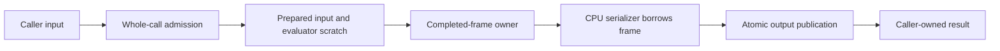

# Resident execution architecture

Resident execution keeps image evaluation and prepared data on Metal while CPU
code performs placement decisions, frame assembly, entropy coding, and emission.
Its organizing boundaries are **ownership, complete-call admission, and CPU/GPU
participation**. It preserves encoder decisions; residency does not imply that
all encoder work runs on the GPU.

This page describes current contracts, followed by the
[historical milestones](#historical-milestones) and their original revision
boundaries. The [historical scheduling qualification](resident-scheduling-qualification.md)
records the integrated comparison and its costs; it is not a performance claim
about every later revision.

Contents:

- [Charter and motivation](#charter-and-motivation)
- [One complete encode](#one-complete-encode)
- [Ownership boundaries](#ownership-boundaries)
- [Admission and storage planning](#admission-and-storage-planning)
- [CPU participation and GPU waits](#cpu-participation-and-gpu-waits)
- [Batches, publication, and shutdown](#batches-publication-and-shutdown)
- [Interfaces and maintenance gates](#interfaces-and-maintenance-gates)
- [Historical milestones](#historical-milestones)

## Charter and motivation

The architectural problem is broader than slow kernels. Independently designed
stages can require owned results, incompatible layouts, long-lived scratch, and
separate resource decisions. Those boundaries make allocation, conversion, and
retention compulsory even when the consumer only needs access to existing data.
Unified memory does not eliminate those traversals or establish safe lifetimes.

The organizing questions are what data is needed, in which representation,
until when, and by whom. The architecture preserves encoding decisions while
making those representation, lifetime, admission, and scheduling boundaries
coherent across the complete workflow.

This work is part of the [Metal encoding performance roadmap](metal-encoding-performance.md).
[Metal AQ](metal-aq.md) remains authoritative for numerical/residency contracts,
and [codestream documentation](codestream.md) for the supported bitstream profile.

## One complete encode

The workflow keeps owners alive across each synchronous consumer. GPU completion
precedes CPU borrowing. Releasing evaluator scratch must not invalidate completed
output, and retaining completed output must not require keeping the evaluator or
backend alive. Allocation tickets follow backing storage through handoff.

Entry points and orchestration live in [workflow.cpp](../src/codestream/workflow.cpp),
with the C adapter in [gjxl.cpp](../src/c_api/gjxl.cpp) and batch orchestration in
[batch_workflow.cpp](../src/codestream/batch_workflow.cpp). CPU and compatibility
Metal routes share the public ownership/admission contracts while retaining their
own component lifetimes and plans.

## Ownership boundaries

| Owner or view | Lifetime and consumer contract |
| --- | --- |
| Caller input | The caller keeps borrowed image backing valid for the synchronous call. Preparation handles layout/color requirements. [Packed resident input](packed-resident-input.md) describes direct C-input preparation and the owned resident result. |
| Prepared input and evaluator scratch | Prepared state belongs to its execution slot and follows image/reuse rules. Scratch can be reused only after its consumers finish; shape compatibility does not permit reusing changed image contents. |
| Completed frame | `CompletedVarDctFrame` owns an exclusive completed-output lease. Its backing survives scratch reuse and producer/backend destruction until the owner is released. |
| Serializer frame view | `VarDctFrameView` borrows immutable backing without allocating or extending its lifetime. It neither waits for GPU completion nor retains a lease. All synchronous serializer workers finish before the owner can be released. |
| Candidate/output storage | Current candidate, retained best, timing, scores, and batch results have distinct owners. Publication transfers completed backing after fallible work succeeds. Public output arguments remain unchanged on failure. |
| Reusable caches | Cache backing keeps its domain-owned accounting ticket. Idle storage and active storage differ; reclamation follows domain identity and completion rules. |

The frame owner/view contract is defined in
[vardct_frame_view_internal.h](../src/codec/vardct_frame_view_internal.h).
The [frame handoff guide](resident-frame-handoff.md) explains direct group-major
output destinations and the legacy owned-frame adapter. Allocation-owned tickets
and final publication live in [managed_allocator.h](../src/core/managed_allocator.h)
and [publication_vector.h](../src/core/publication_vector.h).

Small owned metadata can intentionally outlive or release much larger scratch.
The [reuse dispositions](resident-reuse-dispositions.md) identify retained and
deferred opportunities; [borrowed-handoff experiments](resident-borrowed-handoff-experiments.md)
remain experiments with their own baselines.

## Admission and storage planning

An immutable `ExecutionDomain` supplies a shared managed-memory allowance and
aggregate CPU-participation limit. C, C++, and batch callers can share its identity.
The default domain is shared; equal numeric limits do not make independent
domains interchangeable. A zero managed-memory limit is unlimited but accounted.

Admission reserves a conservative complete-workflow envelope before substantial
work. It does not grow an active reservation to conceal an underestimated plan.
An allocation that exceeds its admitted plan preserves the typed
`ResourcePlanExceeded` classification through exception adapters and retries.
Memory pressure must not silently change effort, candidate sets, or encoder policy.

Allocation counts can be shared between execution and planning. **Lifetime
composition remains component-specific**: phase maxima, overlapping scratch,
retained results, and pooled backing are distinct. See the [shared planning
recipes](planning-recipes.md), [admission preflight](resident-admission-preflight.md),
and [public admission](resident-public-admission.md). Cache accounting and pressure
tradeoffs are documented with those mechanisms rather than inferred from RSS.

Managed committed capacity includes unbacked reservation. The ledger excludes
storage outside its declared ownership/accounting coverage and is not a process
physical-memory cap. Process peak, idle footprint, managed backing, and committed
capacity must be reported separately.

## CPU participation and GPU waits

CPU participation begins after memory admission. Per-image limits draw from the
shared domain. `CpuWorkerGroup` reserves additional participants before thread
construction; `ParallelScope` propagates resource context and nested-work state.
The [shared worker runner](worker-orchestration.md) handles dispatch, launch,
joining and ordered status collection for five stages, preserving their distinct
serial-retry/error policies and scratch indices.

Blocking GPU, join, and one-time-initialization waits suspend CPU participation.
Image callers yield their slot and requeue to resume; suspended workers retain
protected capacity so nested waits cannot multiply dormant worker threads.
Resumption completes before serial fallback or result collection. Nested work
must obey the same domain and per-image limits.

The implementation is in [cpu_execution.h](../src/core/cpu_execution.h),
[thread_budget.h](../src/core/thread_budget.h), and
[parallel_work_internal.h](../src/core/parallel_work_internal.h).
The [CPU coordination record](resident-cpu-coordination.md) explains fairness,
protected capacity, and one-slot progress. This is a synchronous coordinator,
not an OS-thread-count guarantee or a general asynchronous task graph.

## Batches, publication, and shutdown

A batch driver bounds concurrent execution slots and retains ordered per-image
results until atomic array publication. Its plan includes retained results as
well as active work. Fewer admitted slots can reduce footprint and increase
queueing; additional slots do not promise monotonically better throughput.

Shutdown rejects queued work and drains admitted work synchronously. It is not
cancellation. Destruction still requires external callers to have returned.
See [batch lifecycle](resident-batch-lifecycle.md),
[batch timing](resident-batch-timing.md), and
[worker-launch failures](resident-worker-launch.md).

Queue covers arrival through initial CPU admission. Service covers admission
through internally retained-result readiness, including teardown. Ready equals
queue plus service and precedes whole-array publication. Batch/cohort makespan,
per-image latency, and summed worker/GPU durations are different measurements.

## Interfaces and maintenance gates

The [installed interface](installed-interface.md) defines public headers and
required implementation dependencies. Internal planners, worker orchestration,
and test facilities are not automatically installed. The [storage toolchain
contract](storage-toolchain.md) defines the audited libc++ behavior, ABI, and
C++20/C++23 support used by reservation and publication guarantees.

When changing a boundary, verify its allocation owner, live overlap, completion
requirement, and failure publication behavior. Preserve independent numerical
oracles, exact parent/candidate decisions and bytes, resource/admission tests,
worker-failure cleanup, domain reuse, and installed-consumer checks. A historical
failure must be reproduced on the new baseline before it is treated as inherited.

The tracked [qualification package](../tools/resident_qualification/README.md)
reconstructs revisions, accepts explicit corpus/decoder locations, and retains
raw measurements and hashes. Start there for commands and prerequisites. Its
smoke profile includes full correctness and sanitizer gates plus representative
measurement jobs; only the full profile runs the entire performance/pressure
matrix. Each sealed result declares which profile actually ran.

The original integrated comparison accepted resource/ownership benefits alongside
measured regressions in some workloads. Preserve those limitations in the
[historical record](resident-scheduling-qualification.md). Tightening reservations,
changing packing, or optimizing GPU work requires a new, explicitly bounded
comparison. Screening/pruning, predictive AQ, and other quality/time-policy
changes remain separate from these ownership and resource contracts.

## Historical milestones

These records preserve the original implementation sequence and completion
criteria. Status statements and measurements below apply to the revisions
recorded with each milestone. The current architecture and maintenance gates
are described above; earlier checkpoints do not replace a fresh qualification.

The development branch was `refactor/resident-execution` (originally
`refactor/resident-frame-handoff`), in the `../gjxl-resident-frame-handoff` worktree.

### Original scope and status

The proposal numbers below refer to the original architecture discussion, not
the implementation milestone numbers used later in this document.

| Proposal | Scope | Status at completion |
| --- | --- | --- |
| #3: Stable coefficients and frame views | Included | Principal handoff complete in `ca440d1` and `dabe129`: ownership-independent consumers, direct final AC destinations, independent completed-output lease. |
| #4A: Reuse, fusion, shorter intermediate lifetimes | Included, subject to numerical and end-to-end gates | Fusion, shared scratch, deferred preparation and final-use release are qualified. The remaining audited opportunities have explicit dispositions in milestone 5. |
| #4B: Screening, pruning, selective refinement | Separate policy track | Deferred; not an unfinished requirement of this structural refactor. |
| #5: Ownership, resource budgets, scheduling | Included | Complete: independent output ownership, shared whole-workflow memory/CPU admission, explicit shutdown/drain, and queue/service/ready timing. Final integrated-baseline qualification covers resource limits, correctness, performance and pressure costs. |

The integrated preparation branch contributes two commits:

- `e1010fe`: share nine transient F32 planes between AQ and Butteraugli, reduce
  staging capacity, defer provisional metadata, and avoid unrequested host masks.
- `306f153`: bounded volatile Butteraugli capacity caching and explicit trimming.
  Its per-backend and process-wide idle-cache limits do not cover active storage,
  existing AQ pools, or completed output.

Its original design records are [shared scratch and preparation](metal-preparation-integration.md)
and [volatile caching](metal-volatile-preparation-cache.md). Their historical
measurements remain separate. The [joint integration record](resident-execution-integration.md)
qualifies the combination against `a747fca` with preparation at `306f153`.

#### Invariants and exclusions

- Preserve AQ iteration/stopping policy, AC candidate sets and tie rules,
  quantization decisions, coefficient-order policy, entropy behavior, and
  rate-control/backend-selection behavior. Memory pressure must not silently
  lower effort, omit candidates, or select a different encoding policy.
- Preserve the public owned-frame and diagnostic paths, existing validation,
  deterministic output, and atomic failure behavior. Existing nonresident paths
  remain supported; this effort does not promise to migrate every mode to leases.
- Storage, ownership, and scheduling changes require exact parent/candidate
  decisions and codestream bytes for the same backend/options. Arithmetic reuse
  and fusion must also pass existing numerical gates and downstream exactness
  checks. A changed decision requires a separately qualified proposal, not a
  widened tolerance hidden in this refactor.
- Do not require zero copies everywhere. Small independently owned metadata can
  release much larger scratch sooner. Intermediate AQ coefficients need not use
  the final serializer layout when they have different consumers.
- #1/#2 quality-time policy redesign, predictive AQ, #4B search reduction, GPU
  entropy coding, a new general computation-graph framework, and cross-image
  kernel fusion are not prerequisites or completion criteria.

### Milestones and dependencies

Milestones 1 and 2 retain the numbering in the handoff record. The expanded
roadmap adds integration before coordinated resources and scheduling. Each
milestone should remain independently reviewable and record its actual baseline.

#### 1. Ownership-independent consumers — complete

`ca440d1` introduced the read-only frame interface and adapted owned frames.
Serialization, coefficient orders, block contexts, and tokenizers consume the
view without requiring a particular allocation owner.

#### 2. Completed Metal output — complete

`dabe129` writes final AC coefficients directly into serializer-compatible shared
storage and publishes an exclusive completed-frame owner after GPU completion
and validation. It retains neither backend nor evaluator/scratch. Small metadata
snapshots intentionally separate output lifetime from preparation lifetime.

Completion here does not mean minimum peak memory: the workflow can retain a
prepared evaluator for reuse independently of the completed frame. The recorded
milestone-2 footprint is effectively unchanged from milestone 1.

#### 3. Integrate preparation and handoff — complete

The [integration record](resident-execution-integration.md) covers semantic
reconciliation, joint lifetime tests, exact corpus/policy bytes, pinned decoder
and conformance checks, and fresh complete-call/physical-footprint measurements.
Both parent and candidate retain only the documented CPU golden mismatch
(63/64 Release tests); the targeted sanitizer suites pass 3/3 with the recorded
vendor-header limitation. The measured peak falls, but one-second idle footprint
rises with caching; this is not a whole-encoder memory budget.

Deliverables:

- Reconcile `e1010fe` and `306f153` with completed-output generation. Preserve
  distinct ownership of borrowed scratch, cached capacity, and completed frames.
- Bring their design/qualification records into the integrated branch and record
  exact integrated revisions. Preserve historical results as historical.
- Establish a fresh combined correctness, latency, and memory baseline before
  attributing further improvements to resource or scheduling changes.

Acceptance:

- Exact coefficients, scores, and bytes across the existing corpus/policy cases;
  pinned decoder/conformance coverage and inherited failures reported explicitly.
- Joint lifetime tests: changed images and dimensions, evaluator reconfiguration,
  serialization during evaluator reuse, backend/evaluator destruction, forced
  idle reclamation, trim during active work, and failed preparation/submission.
- Complete-call timing including teardown; peak and idle footprint with the
  backend alive. Concurrent correctness stress is not throughput qualification.

#### 4. Coordinated resource accounting and admission — complete

Depends on milestone 3's integrated ownership model. Start with a small explicit
set of resource classes and reservations, not a general graph runtime.

The [resource implementation record](resident-resources.md) contains the
source-backed ownership inventory, integration decisions, and tested primitive
for reservation/allocation lifetimes and FIFO admission. The
[Metal attachment checkpoint](resident-metal-accounting.md) adds real backing
charges, domain-aware cache transitions, and all-pool trim with physical-memory
and complete-call measurements. The [host attachment checkpoint](resident-host-accounting.md)
adds writer/image-plane backing and joined CPU worker propagation. The
[serializer attachment](resident-serializer-accounting.md) extends this to owned
token/model/candidate containers, with exact parity and measured overhead. The
[frontend attachment](resident-frontend-accounting.md) covers preparation/evaluation
arrays and completed-frame metadata, with exact parity and measured costs. The
[publication attachment](resident-publication-accounting.md) adds candidate and
retained codestream-byte ownership through C/C++ and batch publication. The
[diagnostic attachment](resident-diagnostic-accounting.md) extends retained
ownership to score histories, summaries, attempt timings and GPU profile graphs.
The [shared device plans](resident-storage-planning.md) extract checked layouts
and AC-search capacities for reuse by upfront planning and actual allocation.
The [host/token bounds](resident-token-storage-planning.md) add reviewed vector
growth/replacement bounds, shared AC/DC token reservations, and aggregate token
owners plus worker scratch across order/context-map candidates.
The [entropy bounds](resident-entropy-storage-planning.md) cover aggregation,
Prefix/ANS model search and retained candidates, and model/token writer scratch;
they also close the missed high-density clustering-queue accounting attachment.
The [representation bounds](resident-representation-storage-planning.md) cover
coefficient-order counts, sampling, permutations, worker reduction and retained
cleared scans, plus ordinary/exhaustive context-map selection and replacement.
The [whole-serializer plan](resident-serializer-storage-planning.md) composes
these bounds with candidate/dispatcher storage, current automatic nesting,
header and section writers, assembly and retained output publication.
The [frontend representation bounds](resident-frontend-storage-planning.md)
cover image planes, owned CPU frames, packed prepared forward coefficients and
atomic reconstruction scratch, including tile lists and dispatch backing.
The [field and color-correlation bounds](resident-field-storage-planning.md)
cover initial-quantization row workers/atomic fields, adjustment, quantizer
selection and per-tile CfL scratch with independently retained map output.
The [preprocessing/perceptual bounds](resident-perceptual-storage-planning.md)
cover color dispatch/atomic images, nested filter scratch, block reductions and
native Butteraugli prepared/one-shot ownership and multiscale replacement. They
also preserve typed underplan errors across six previously generic wrappers.
The [AC-search host bounds](resident-ac-search-storage-planning.md) cover CPU
placement/export and fresh/reused candidate, matrix, cost-table and staging
owners. Their isolated host and mixed-library Metal checks do not replace
whole-workflow qualification or include backend submission/profile metadata.
The [profile-graph bounds](resident-profile-storage-planning.md) add char-string
growth and nested diagnostics, including original/snapshot overlap during Metal
profile resolution. Backend stage/context arrays and policy-to-count planning
remain separate.
The [Metal AQ host bounds](resident-aq-host-storage-planning.md) add prepared and
reconfigured metadata, lazy diagnostics, exact-input staging, and the independent
completed-frame host snapshot. Failure injection also closes an exact-input
group-offset exception escape while preserving typed underplans.
The [submission metadata bounds](resident-submission-storage-planning.md) share
AC validated-batch/profile-input and resident AQ context-array reserves with
execution. They compose AC recording/resolution with a five-dispatch-per-batch
bound and prevent context-array growth from invalidating recorded pointers.
AQ/Butteraugli dispatch counts and complete workflow composition remain separate.
The [AQ profile counts](resident-aq-profile-storage-planning.md) subsequently
derive those dispatch bounds from policy and geometry, including multi-pass
reductions, optional initial bitonic sorting, reference preparation, adjustment
and final output. They compose individual profile graphs without observed-count
allowances; host policy and complete workflow/session composition are still pending.
The [whole resident workflow plan](resident-workflow-storage-planning.md) now
composes production Metal Butteraugli preparation, AC/AQ, completed output,
serialization and parent diagnostic sessions, including forced-Metal size-search
retention. Complete cold/warm encodes fit its preflight reservation. Other
backend/policy paths remain separate.
The [native CPU workflow plan](resident-cpu-workflow-storage-planning.md) adds
the shared CPU-side AQ policy, native evaluator old/new overlap, compatibility
destinations and complete CPU Butteraugli/maximum-error/size-search lifetimes.
Its isolated AQ and complete CPU encodes fit precomputed reservations without
changing runtime object code.
The [compatibility workflow plans](resident-compatibility-workflow-storage-planning.md)
add exact-coefficient, resident maximum-error and maximum-throughput lifetimes,
plus simultaneous CPU/Metal preparation in automatic exact-coefficient searches.
The [unified preflight and cache-progress checkpoint](resident-admission-preflight.md)
composes selected policy recipes with packed C conversion/publication and
streamed batch retained-result, work-slot and per-pool idle bounds. It also adds
queued eviction and matching-domain all-backend cache reclamation. The
[public admission checkpoint](resident-public-admission.md) now connects route
selection, shared C/C++ domains, complete-call reservations and batch slot/trim
enforcement. Its passing whole-workflow qualification and pressure tradeoffs are recorded separately;
the earlier component checkpoints alone do not satisfy the milestone.

Deliverables:

- A source-backed inventory of allocation owners, capacities, aliases, last
  consumers, and release/reuse boundaries: input staging, reference/prepared
  state, AQ/Butteraugli scratch, completed frames, CPU serializer temporaries,
  and idle caches. Classify retained batch codestream results explicitly too.
- A common ledger that counts each backing allocation once. Separate requested
  live bytes, reserved capacity, and retained idle capacity; distinguish all
  three from measured physical footprint and OS-reclaimable pages.
- Define the admission domain and its relationship to the shared production
  backend, explicit backends, concurrent single-image calls, and batch drivers.
  Calls sharing a budget must not each receive an independent full allowance.
- Reserve before allocation/work admission, transfer accounting on reuse or
  ownership changes, and release reservations on every failure and teardown path.
  Include prepared state retained across attempts and completed outputs awaiting
  consumers, rather than admitting only the nominal GPU scratch size.
- Document the configured managed-memory boundary and exclusions. Caller-owned
  inputs, returned results, driver allocations, and process RSS must not be
  implicitly promised as bounded by a scratch-capacity limit.
- Define exhaustion behavior, cache shedding, and trimming. Reject an image
  that cannot fit the configured hard managed limit with a clear failure before
  expensive work, rather than waiting forever or silently exceeding that limit.
  Admitted work must be able to drain without another job holding its required
  capacity. Any staged reservation growth needs a demonstrated progress rule.

The resource record specifies the configuration surface, defaults, domain
ownership, reservation strategy and treatment of retained batch results. The
memory configuration, entry-point selection and input/batch enforcement are now
implemented. Aggregate CPU-domain configuration/enforcement is separately
implemented and qualified in milestone 6; it is not a process-RSS or OS-thread
count promise of the memory API.

Acceptance:

- Deterministic accounting tests for aliasing, cache hits/misses/growth, trim,
  reclamation, retries, exceptions, and destruction; no leaked reservations.
- Concurrent small/large jobs and multiple callers/backends exercise the declared
  domain, including under-budget rejection and waiting-job progress. Failed
  requests preserve outputs and leave subsequent work usable.
- Counters reconcile with owned allocation capacities. Physical peak/idle
  measurements are reported separately, including any excluded memory.

#### 5. Targeted reuse and lifetime reductions — complete

The inventory from milestone 4 defines the opportunities. Individual #4A changes
can proceed alongside its accounting implementation, after milestone 3.

The [last-use release checkpoint](resident-last-use.md) implements source-aware
AC release after final placement and prepared-evaluator/input release before the
CPU tail of a final completed-frame attempt. Earlier size-search attempts retain
reuse, and phase planning continues charging idle caches. Its qualification and
measured disposition are recorded separately; the remaining audit and admission
and scheduling milestones are not completed by these boundaries alone.
The [final reuse/fusion dispositions](resident-reuse-dispositions.md) close the
audited set with source-backed dependency/lifetime reasoning, fresh phase
evidence and explicit retained/deferred choices. No further unbounded fusion
requirement remains. Aggregate CPU scheduling is qualified separately in
milestone 6 below.

Deliverables:

- For each material temporary or repeated calculation, identify producer,
  consumers, lifetime, and whether elimination/reuse changes arithmetic order.
  Record candidates as implemented, rejected after measurement, or explicitly
  deferred with a reason; do not leave an open-ended requirement to fuse more.
- Prioritize measured costs: unnecessary materialization, repeated metadata
  preparation, scratch surviving its last consumer, and exact shared calculations
  across current candidates. Reusing transform arithmetic requires a valid
  factorization; pruning candidates is still outside this milestone.
- Feed revised capacities and lifetime transitions back into milestone 4's
  accounting. Preserve reference data and completed output across scratch reuse.

Acceptance:

- Numerical and downstream exactness gates, including boundary/padded images and
  diagnostics. Explicit lifetime/failure coverage for each new alias or reuse.
- Complete-encode or peak/idle-memory benefit under stated workloads, with
  downstream costs and regressions reported. Fewer passes or allocations alone
  do not establish a performance win; unsuccessful experiments need not ship.
- The audited set has a recorded disposition. Intentional remaining copies and
  materializations are documented rather than treated as unbounded follow-up.

#### 6. Coordinated CPU/GPU scheduling — complete

Depends on stable output lifetimes and working admission from milestone 4;
milestone 5 changes require updated resource estimates and requalification.

The [CPU coordination checkpoint](resident-cpu-coordination.md) adds shared C/C++
domain limits, caller/worker participation, FIFO admission and yielded GPU/join
boundaries. The [batch lifecycle checkpoint](resident-batch-lifecycle.md) adds
explicit shutdown/drain with active and queued calls. The
[batch timing checkpoint](resident-batch-timing.md) separates arrival queueing,
image service and retained-result readiness from whole-array publication.
The [worker-launch checkpoint](resident-worker-launch.md) exercises actual
parallel-loop construction failures, recovery and concurrent shutdown. The
[final integrated-baseline qualification](resident-scheduling-qualification.md)
closes this milestone: 56 corpus/policy byte comparisons, pinned decoding and
conformance, permanent/sanitizer tests, 189 alternating-process performance
pairs and 42 pressure processes. It records both memory benefits and latency
regressions; this is not a general speedup claim.

The [batch driver](../src/codestream/batch_workflow.h) already permits one image's
CPU work to overlap another's Metal work. It invokes independent single-image
workflows, whose [per-image CPU budgets](../src/core/thread_budget.h) now also
draw from their shared domain. The
goal is coordinated use of that capability, not a claim of introducing overlap
for the first time.

Deliverables:

- Coordinate CPU participation across admitted jobs, including caller threads
  and nested serializer work; per-image thread limits must not multiply into
  an unbounded aggregate allocation of workers.
- Make admission and scheduling aware of preparation, GPU completion, and CPU
  consumption. Release reusable scratch after its last actual consumer while
  preserving references needed for retries and output needed by serialization.
- Preserve each image's dependency order and deterministic decisions, request
  ordering, individual failure reporting, and driver shutdown behavior. Define
  fairness so an otherwise admissible large request cannot starve indefinitely.
- Use the smallest explicit scheduling mechanism that achieves these goals.
  Replacing the batch driver or adding asynchronous public APIs is not required.

Acceptance:

- Single-image/batch byte parity across thread and in-flight settings; mixed-size
  and changed-image workloads; simultaneous callers; failures and shutdown while
  work is active or waiting. No deadlock, stale borrowed data, or starvation.
- Instrumented aggregate CPU participation and managed capacity respect their
  declared limits. Measure queued and service latency as well as batch throughput.
- Repeated independent-process comparisons against the integrated baseline,
  including single-image regressions, memory-pressure cases, and a range of
  in-flight counts. Concurrency correctness alone is insufficient.

### Qualification and completion contract

Use fresh Release parent/candidate builds and record revisions, build flags,
hardware, input metadata/hashes, effort, AQ mode, distance, CPU budget, memory
budget, and in-flight count. Warm up, alternate independent process order, and
retain multiple samples on small, natural, padded 1080p/4K, and mixed-size inputs.

Measure the complete in-memory encode including evaluator teardown. Report cold
backend setup separately. For batches, include admission/queueing and completion
of all results in makespan, and report per-image latency separately. GPU-stage
timings and aggregate worker counters explain attribution, not encoder latency.
Record peak, backend-alive idle, and post-trim memory with measurement boundaries.

Each milestone reruns relevant permanent tests and the corpus/policy, pinned
decoder, and conformance gates. Preserve output atomicity and existing numerical
thresholds. The handoff checkpoint has a known CPU `quantization_pipeline` golden
mismatch; reproduce it on each fresh comparison baseline rather than assuming a
future failure is inherited. Record sanitizer limitations explicitly.

The structural effort is complete when milestones 3–6 satisfy their gates:
integrated ownership is qualified, declared resources are coherently accounted
and admitted, the audited reuse opportunities have dispositions, and cross-image
scheduling obeys resource limits with qualified correctness/performance. Maintain
reviewable milestone commits and durable summaries identifying raw artifacts.

That contract is now satisfied by the completed records above. The final
qualification compares runtime `07dd92e` with integrated baseline `ec4d4c5` and
seals the evidence. It preserves the known golden mismatch and scoped sanitizer
limitations rather than declaring an entirely green or universally faster build.

Completion does not require every intermediate to disappear, every workload to
speed up, or all encoding work to move to Metal. It does require explicit costs,
lifetimes, limits, and evidence for the choices retained. No fixed speedup is
promised by this roadmap.

### Separate policy track: #4B and #1/#2

Candidate screening/pruning, selective regional refinement, predictive AQ, and
different iteration/stopping policies may use this infrastructure later. They
need independent natural-image and difficult-image size/quality curves,
decoded-pixel and Butteraugli measurements, determinism, and rate-control checks.
Changing policy is not a way to pass the structural branch's performance gates.
This track is deferred and is not a dependency of milestones 3–6.
