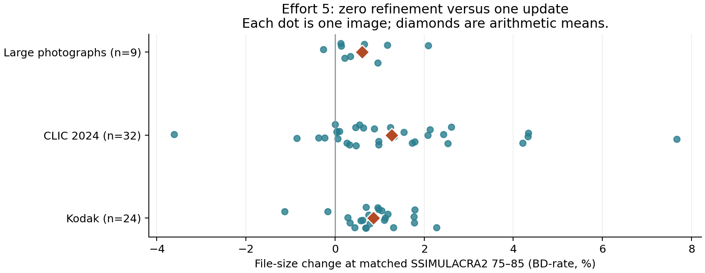

# Effort 5: zero-refinement quality qualification

The branch implements zero Butteraugli-guided quantization-field refinement updates at ordinary effort 5. **Controlled AC timing is complete: -42.47% aggregate warm call time; timing gates passed.** See the [timing qualification and adoption decision](timing-confirmation/report.md), including the retained first-run control failure and collection history. No speedup is inferred from incidental quality-probe timings, and the existing paper throughput row is unchanged.

| Policy | e4 | e5 candidate | e6 |
| --- | --- | --- | --- |
| Transform selection | Fixed DCT8 | Mixed search | Mixed search |
| Initial field | Uniform | Spatial | Spatial |
| Gaborish | Off | On | On |
| Refinement updates | 0 | **0** | 1 |

High-density and maximum-error overrides retain their existing behavior. Target-byte/BPP retries and explicit maximum compression follow the new ordinary e5 update count. CPU and exact-coefficient paths still evaluate their final field; ordinary fully resident Metal e5 omits perceptual evaluation unless final scoring is requested.

## Rate–quality results

Fresh baseline and candidate encodes cover all **65 images × 5 distances × 2 arms = 650 curve points**. Each point reproduced identical bytes across two complete encodes, decoded successfully through pinned libjxl, and produced finite linear-sRGB samples and a finite fast-ssim2 score. The distance grid is 4.6, 2.8, 1.9, 1.0, 0.55. All 65 curves are strictly monotone and bracket 75–85; there is no extrapolation or curve repair.

| Corpus | Images | Mean BD-rate | Minimum | Maximum |
| --- | ---: | ---: | ---: | ---: |
| Kodak | 24 | +0.864% | -1.131% | +2.280% |
| CLIC 2024 | 32 | +1.270% | -3.618% | +7.667% |
| Large photographs | 9 | +0.603% | -0.259% | +2.090% |
| **All images** | **65** | **+1.028%** | -3.618% | +7.667% |

PCHIP is primary; Akima sensitivity gives **+0.992%**. These are arithmetic means of per-image BD percentages, not a pooled curve or a ratio of total bytes. Positive values mean larger files.

## Independent perceptual checks

Twelve images were selected before measurement: four Kodak, four CLIC (including the earlier experiment’s worst case), and four large photographs covering 12, 24, and 48 MP. Each arm was independently calibrated to SSIMULACRA2 80 ±0.025 with at most fourteen new probes. **Only 8/12 pairs met the original strict target**: four Kodak targets exhausted their budgets. Those original failures remain unchanged in `matches.jsonl`; this is not complete strict score-80 calibration. A separate, explicitly post hoc phase selected the closest existing score pairs for those four images, requiring each score within 80 ±0.1 and pair difference ≤0.01. Their actual differences are below 0.004. This secondary phase used no new encodes and did not reset calibration budgets. The following twelve-image results combine the eight strict pairs with those four separately labeled near-target pairs. Independent pinned libjxl Butteraugli scoring uses linear sRGB and an 80-nit intensity target. These are Butteraugli comparisons at matched SSIMULACRA2, not matched-Butteraugli rate measurements.

| At matched SSIMULACRA2 ≈80 | Mean change | Minimum | Maximum |
| --- | ---: | ---: | ---: |
| File size | +0.483% | -4.198% | +1.677% |
| Butteraugli error (lower is better) | +1.801% | -18.053% | +19.294% |

Per-image results make the metric disagreement visible. A higher Butteraugli error is a perceptual-metric regression even when the SSIMULACRA2 score is matched; these percentages are not human severity ratings.

| Image | Matching | Size near score 80 | Butteraugli error near score 80 |
| --- | --- | ---: | ---: |
| Kodak 01 | secondary pair | +1.677% | +19.294% |
| Kodak 08 | secondary pair | +1.475% | +15.786% |
| Kodak 13 | secondary pair | +1.185% | +3.675% |
| Kodak 23 | secondary pair | +0.461% | -4.018% |
| CLIC 097cb426 | strict target | -4.198% | +2.042% |
| CLIC 100a02c2 | strict target | +0.833% | -18.053% |
| CLIC 28d24b9c | strict target | +0.663% | +0.849% |
| CLIC d1a9be98 | strict target | +1.187% | -17.698% |
| alpine_lake/24mp | strict target | -0.397% | +3.763% |
| campus_interior/12mp | strict target | +1.011% | +15.256% |
| campus_interior/48mp | strict target | +1.084% | -5.724% |
| forest_stream/48mp | strict target | +0.818% | +6.435% |

The three largest observed BD-rate regressions were also checked after selection. These diagnostic cases are separate from the preselected twelve-image means:

| Image | BD-rate 75–85 | Size at score 80 | Butteraugli error at score 80 |
| --- | ---: | ---: | ---: |
| CLIC d79d465a | +7.667% | +8.152% | +20.462% |
| CLIC ef576c4e | +4.338% | +4.013% | +10.316% |
| CLIC c80999cd | +4.328% | +3.368% | +14.713% |

## Correctness and evidence

- Release native suite: **170/170 passed**. Focused tests cover the e5/e6 CPU/Metal score schedule, storage admission, initial-field/Gaborish boundary, and final-score byte parity.
- **23 additional byte controls passed**: unchanged e1–4/e6–10 and explicit overrides, CPU/exact e6, selected larger images, e5 scored/unscored paths, and CPU/Metal target-byte/BPP retries.
- E5/e6 finite-budget batch checks passed with Metal API and shader validation: two concurrent callers, four images per batch, two odd-sized inputs, three rounds, and a shared eight-CPU limit. The driver checks reference bytes and memory/CPU admission bounds.
- Focused workflow and effort-policy tests passed with Metal API and shader validation. Two broader storage tests aborted on `gjxl_aq_dc_quantize`: threadgroup memory 49,152 bytes exceeds 32,768. **Both failures reproduced in an independently built unchanged baseline.** This is an existing validation limitation, not evidence of a new e5 regression; full debug validation is not qualified.
- With API validation alone, compatibility storage passed, but resident storage timed out after 605.57 seconds, after reporting 223 completed bounded cases. This additional timeout remains unresolved; the original ordinary run passed that test. All failed and successful logs are retained.
- Baseline and candidate Metal shader SHA-256 are identical. The implementation change is in the shared host policy resolver; the candidate has no shader changes.
- CUDA is not physically qualified on this Mac. This is a photographic-corpus quality study, not a universal visual-quality guarantee.

## Reproduction and remaining decision

Baseline: `67caa6d89830f6a13c057923e34f80753a161e9d`. Candidate: that revision plus the retained `source.patch`. Apple M4 Pro, 14 CPU cores (10 performance, 4 efficiency), 48 GB. Separate Release builds use ordinary fully resident Metal, eight participating CPU threads, default density, automatic compression, weighted/prediction-aware DC with smoothing, native resolution, and final diagnostic scoring disabled. All inherited GJXL/RCA overrides are removed.

Full immutable source snapshots, native binaries, shaders, inputs/tool hashes, commands, raw samples, and codestreams are retained in `/Users/yunhocho/GitHub/gjxl-e5-speed/build/e5-qualification`. The accompanying ledgers retain output and decoded-pixel hashes. `package.json` pins this exported evidence. The collectors and timing protocol are in `tools/e5_refinement/README.md`.

The [completed AC-powered timing qualification](timing-confirmation/report.md) weighs these size/perceptual tradeoffs against controlled complete-call timing. It uses the eight strict and four secondary near-80 pairs, retaining the original strict target failures. Review the baseline-reproduced debug assertion and unresolved API-validation timeout separately. Do not replace the paper’s historical e5 MP/s or same-effort libjxl BD-rate with this GJXL-versus-GJXL study.
