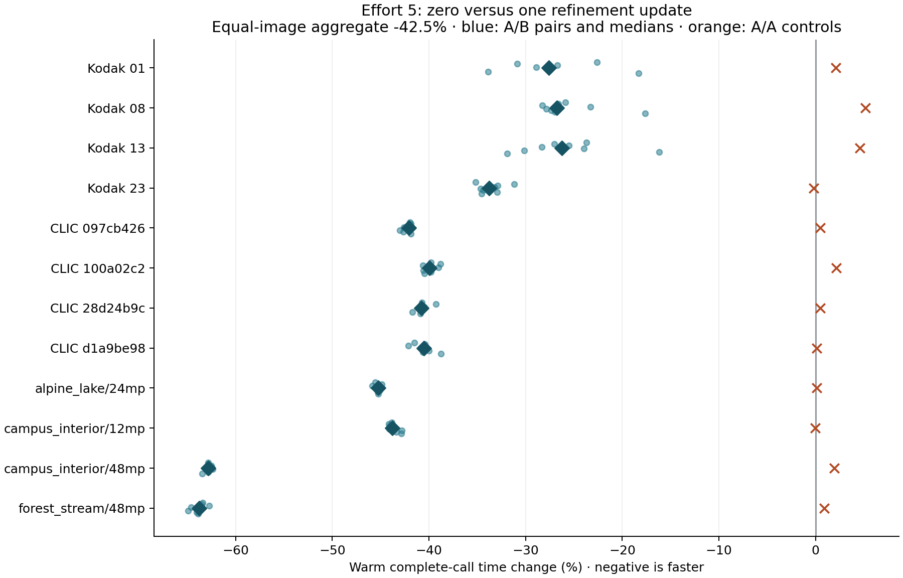

# Effort 5: AC-powered timing confirmation

**Timing gates: passed.** Zero refinement changes equal-image warm complete-call time by **-42.47%** (conditional 95% interval **-42.81% to -42.04%**), equivalent to **1.738×** throughput on this fixed twelve-image cohort.

The measured tradeoff supports adopting zero refinement as the faster e5 tier on the tested Metal backend, while retaining e6’s one-update policy. This is a speed/quality tradeoff, not a compression-preserving optimization.

The preceding 65-image rate study measured **+1.028% mean BD-rate**, with a **+7.667%** worst image over SSIMULACRA2 75–85. Independent near-80 checks included image-specific Butteraugli regressions, reaching +20.46% in the worst rate outlier. Those three post-selection quality outliers are not part of this preselected timing cohort. See the [quality report](../report.md) for per-image results, matching limits, and existing debug-validation failures.

## Protocol and scope

- Apple M4 Pro, 14 CPU cores, 48 GB; AC power, ordinary fully resident Metal, e5, eight participating CPU threads, default density and automatic compression.
- Exact retained baseline and candidate executables, shaders, source snapshots, inputs, and output hashes verified before collection and audit. No rebuild or new quality calibration during collection.
- Twelve measured near-80 quality pairs: eight strict target pairs plus four secondary saved-probe pairs. The original four strict calibration failures remain unresolved; timing does not convert them into strict successes.
- Eight A/B process pairs per image, divided into two blocks; rotating image order and balanced baseline/candidate process order. Two same-baseline A/A process pairs per image are interleaved across the blocks.
- Each process performs one validation encode, two warmups, and five timed calls. Every repeated encode must reproduce its expected codestream, and each process output must match the corresponding retained quality-study hash.
- Boundary: synchronous public encode-call wall time, including its complete normal work and synchronization. Input loading, process/Metal initialization, output hashing and file writing are outside timing. These are warm single-image calls, not batch or cold-start results.
- One-second environment monitoring rejects entire pairs for declared CPU pressure, competing encoders/builds, loss of AC power, thermal warnings, swap growth, or monitoring errors. Exclusion decisions never inspect latency. All attempts are retained.
- **96 accepted A/B pairs + 24 A/A pairs**, **240 processes**, **1,200 timed calls**, **1,920 total accepted encodes**. **10 excluded pairs**. Accepted pairs had no swap growth.

The primary estimate is the equal-image geometric mean of each image’s median paired candidate/baseline ratio. Each process value is the median of five calls. The confidence interval resamples process pairs within each fixed image (10,000 draws, seed 20261007); it measures conditional repeat uncertainty, not generalization to unseen images. Open desktop applications remain part of the environment, subject to the declared sampled admission thresholds.

### Collection history

Exactly one fresh complete confirmation was declared after the first run failed its Kodak 08 A/A control. This run began with the authorized media-analysis pause already active. It uses the same binaries, quality pairs, warmups, samples, load thresholds and timing gates, with the previously amended twelve-attempt retry limit. The decision also requires the aggregate candidate/baseline ratio to agree with the first run within 0.05. The [first failed run](../timing/report.md) remains separate and is never pooled, replaced, or relabeled as passing.

With explicit user approval, `mediaanalysisd` was temporarily suspended under a watchdog during collection. The watchdog resumed it on collector exit, with a thirty-minute fallback. Every recorded pause has a corresponding restoration event; the service-control ledger and watchdog sources are included in this package. Other desktop applications remained running.

A separately authorized pause of `spotlightknowledged.updater` was needed before the confirmation admitted its first pair. After the user requested autonomous continuation, this pause was extended to the remaining `spotlightknowledged` indexer. Both used the same exit/timeout restoration safeguards and are recorded in the service-control ledger. This is an environment-management change from the first run; the numerical admission thresholds stayed unchanged.

A single separately logged foreground encoding burst tested the suggestion that background work would quiet under load. It comprised 32 samples plus two warmups and one validation encode per arm on forest_stream/48mp; these 70 encodes are excluded from the scheduled experiment. Spotlight remained active, and the monitored quiet admission criteria stayed unchanged.

## Results

| Image | Matching | Baseline ms | Candidate ms | Paired time change | A/A change |
| --- | --- | ---: | ---: | ---: | ---: |
| Kodak 01 | secondary pair | 12.568 | 9.020 | -27.59% | +2.10% |
| Kodak 08 | secondary pair | 12.601 | 9.123 | -26.79% | +5.16% |
| Kodak 13 | secondary pair | 11.974 | 8.819 | -26.27% | +4.58% |
| Kodak 23 | secondary pair | 11.359 | 7.555 | -33.79% | -0.20% |
| CLIC 097cb426 | strict target | 41.209 | 23.868 | -42.08% | +0.51% |
| CLIC 100a02c2 | strict target | 36.952 | 22.072 | -39.96% | +2.14% |
| CLIC 28d24b9c | strict target | 35.304 | 20.975 | -40.77% | +0.50% |
| CLIC d1a9be98 | strict target | 34.128 | 20.290 | -40.52% | +0.11% |
| alpine_lake/24mp | strict target | 235.237 | 128.192 | -45.23% | +0.13% |
| campus_interior/12mp | strict target | 136.402 | 76.601 | -43.77% | -0.03% |
| campus_interior/48mp | strict target | 640.177 | 239.916 | -62.85% | +1.92% |
| forest_stream/48mp | strict target | 633.976 | 230.539 | -63.79% | +0.91% |

Milliseconds are medians of process medians; the paired-change column is computed from paired ratios, so it need not equal the ratio of the displayed time columns.

Unchanged-binary A/A aggregate change: **+1.47%**. Block 1 / block 2 A/B changes: **-42.59% / -42.35%**.

| Matching stratum | Images | Paired time change |
| --- | ---: | ---: |
| secondary-saved-probe-match | 4 | -28.67% |
| strict-target | 8 | -48.34% |

## Predeclared timing gates

| Gate | Result |
| --- | --- |
| A/A aggregate within ±3% | Pass |
| Every A/A image median within ±10% | Pass |
| At least 15% aggregate time reduction | Pass |
| Conditional 95% interval entirely below no change | Pass |
| No per-image median slowdown above 5% | Pass |
| Confirmation aggregate ratio within 0.05 of first run | Pass (0.00010) |

The first run measured **-42.48%** aggregate time change; this confirmation measures **-42.47%**. The first run’s Kodak 08 A/A median was **+13.657%**, outside the original ±10% image-control limit. That failed result remains reported as failed; the confirmation is a separate experiment with the same acceptance gates.

## Evidence and remaining boundaries

Full raw timing artifacts are retained at `/Users/yunhocho/GitHub/gjxl-e5-speed/build/e5-timing-confirmation-20261007`. `package.json` hashes the exported ledgers and report; `analysis.json` additionally hashes the complete environment and command logs in the raw directory. The original quality evidence and all debug-validation failures are preserved. The timeout and baseline-reproduced Metal validation assertion remain separate unresolved issues; this timing run is uninstrumented and does not certify debug validation.

This experiment does not refresh the paper’s historical e5 MP/s row or its comparison against libjxl. It qualifies this exact candidate versus this exact baseline at the selected measured near-80 settings. CUDA and batch throughput require their own measurements. No merge, commit, or push is implied.
