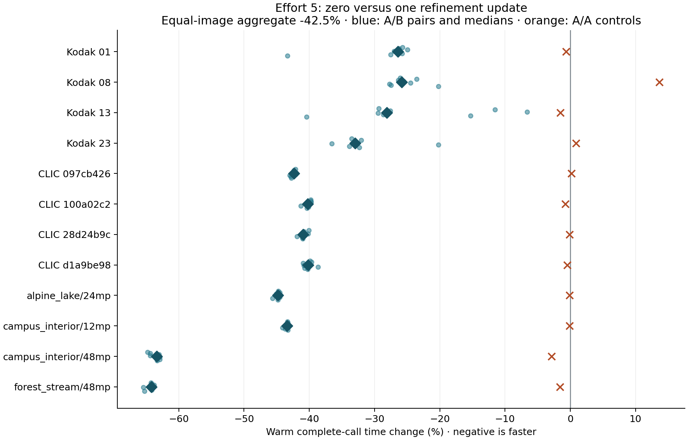

# Effort 5: AC-powered timing qualification

**Timing gates: not all passed.** Zero refinement changes equal-image warm complete-call time by **-42.48%** (conditional 95% interval **-42.79% to -41.48%**), equivalent to **1.739×** throughput on this fixed twelve-image cohort.

This run does not satisfy every predeclared timing gate. Keep the policy as a candidate until the failed gates are resolved; do not present this as an unconditional timing qualification.

The preceding 65-image rate study measured **+1.028% mean BD-rate**, with a **+7.667%** worst image over SSIMULACRA2 75–85. Independent near-80 checks included image-specific Butteraugli regressions, reaching +20.46% in the worst rate outlier. Those three post-selection quality outliers are not part of this preselected timing cohort. See the [quality report](../report.md) for per-image results, matching limits, and existing debug-validation failures.

## Protocol and scope

- Apple M4 Pro, 14 CPU cores, 48 GB; AC power, ordinary fully resident Metal, e5, eight participating CPU threads, default density and automatic compression.
- Exact retained baseline and candidate executables, shaders, source snapshots, inputs, and output hashes verified before collection and audit. No rebuild or new quality calibration during collection.
- Twelve measured near-80 quality pairs: eight strict target pairs plus four secondary saved-probe pairs. The original four strict calibration failures remain unresolved; timing does not convert them into strict successes.
- Eight A/B process pairs per image, divided into two blocks; rotating image order and balanced baseline/candidate process order. Two same-baseline A/A process pairs per image are interleaved across the blocks.
- Each process performs one validation encode, two warmups, and five timed calls. Every repeated encode must reproduce its expected codestream, and each process output must match the corresponding retained quality-study hash.
- Boundary: synchronous public encode-call wall time, including its complete normal work and synchronization. Input loading, process/Metal initialization, output hashing and file writing are outside timing. These are warm single-image calls, not batch or cold-start results.
- One-second environment monitoring rejects entire pairs for declared CPU pressure, competing encoders/builds, loss of AC power, thermal warnings, swap growth, or monitoring errors. Exclusion decisions never inspect latency. All attempts are retained.
- **96 accepted A/B pairs + 24 A/A pairs**, **240 processes**, **1,200 timed calls**, **1,920 total accepted encodes**. **9 excluded pairs**. Accepted pairs had no swap growth.

The primary estimate is the equal-image geometric mean of each image’s median paired candidate/baseline ratio. Each process value is the median of five calls. The confidence interval resamples process pairs within each fixed image (10,000 draws, seed 20261007); it measures conditional repeat uncertainty, not generalization to unseen images. Open desktop applications remain part of the environment, subject to the declared sampled admission thresholds.

### Collection history

After 33 accepted and seven environment-excluded pairs, one case exhausted its original three-attempt budget. A recorded amendment increased the budget uniformly to twelve attempts per pair; the original manifest and attempt ledger are preserved. The decision addressed background-load exclusions before aggregate timing analysis. All timing gates, load thresholds, sample counts, quality settings and ordering stayed unchanged. Excluded attempts never enter the timing estimate.

With explicit user approval, `mediaanalysisd` was temporarily suspended under a watchdog during collection. The watchdog resumed it on collector exit, with a thirty-minute fallback. Every recorded pause has a corresponding restoration event; the service-control ledger and watchdog sources are included in this package. Other desktop applications remained running.

## Results

| Image | Matching | Baseline ms | Candidate ms | Paired time change | A/A change |
| --- | --- | ---: | ---: | ---: | ---: |
| Kodak 01 | secondary pair | 12.320 | 9.057 | -26.42% | -0.64% |
| Kodak 08 | secondary pair | 12.355 | 9.336 | -25.80% | +13.66% |
| Kodak 13 | secondary pair | 11.973 | 8.559 | -28.12% | -1.55% |
| Kodak 23 | secondary pair | 11.248 | 7.581 | -32.99% | +0.89% |
| CLIC 097cb426 | strict target | 40.758 | 23.492 | -42.36% | +0.17% |
| CLIC 100a02c2 | strict target | 36.532 | 21.805 | -40.24% | -0.74% |
| CLIC 28d24b9c | strict target | 35.167 | 20.828 | -40.94% | -0.11% |
| CLIC d1a9be98 | strict target | 34.024 | 20.421 | -40.19% | -0.46% |
| alpine_lake/24mp | strict target | 230.828 | 127.337 | -44.82% | -0.12% |
| campus_interior/12mp | strict target | 134.469 | 76.158 | -43.40% | -0.12% |
| campus_interior/48mp | strict target | 642.064 | 236.000 | -63.38% | -2.89% |
| forest_stream/48mp | strict target | 635.262 | 227.632 | -64.18% | -1.55% |

Milliseconds are medians of process medians; the paired-change column is computed from paired ratios, so it need not equal the ratio of the displayed time columns.

Unchanged-binary A/A aggregate change: **+0.47%**. Block 1 / block 2 A/B changes: **-42.75% / -41.93%**.

| Matching stratum | Images | Paired time change |
| --- | ---: | ---: |
| secondary-saved-probe-match | 4 | -28.39% |
| strict-target | 8 | -48.45% |

## Predeclared timing gates

| Gate | Result |
| --- | --- |
| A/A aggregate within ±3% | Pass |
| Every A/A image median within ±10% | **Fail** |
| At least 15% aggregate time reduction | Pass |
| Conditional 95% interval entirely below no change | Pass |
| No per-image median slowdown above 5% | Pass |

Failed unchanged-binary image controls:
- Kodak 08: individual A/A pairs +27.257%, +0.056%; median +13.657%. These accepted measurements remain in the analysis.

## Evidence and remaining boundaries

Full raw timing artifacts are retained at `/Users/yunhocho/GitHub/gjxl-e5-speed/build/e5-timing-20261007`. `package.json` hashes the exported ledgers and report; `analysis.json` additionally hashes the complete environment and command logs in the raw directory. The original quality evidence and all debug-validation failures are preserved. The timeout and baseline-reproduced Metal validation assertion remain separate unresolved issues; this timing run is uninstrumented and does not certify debug validation.

This experiment does not refresh the paper’s historical e5 MP/s row or its comparison against libjxl. It qualifies this exact candidate versus this exact baseline at the selected measured near-80 settings. CUDA and batch throughput require their own measurements. No merge, commit, or push is implied.
