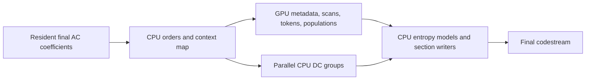
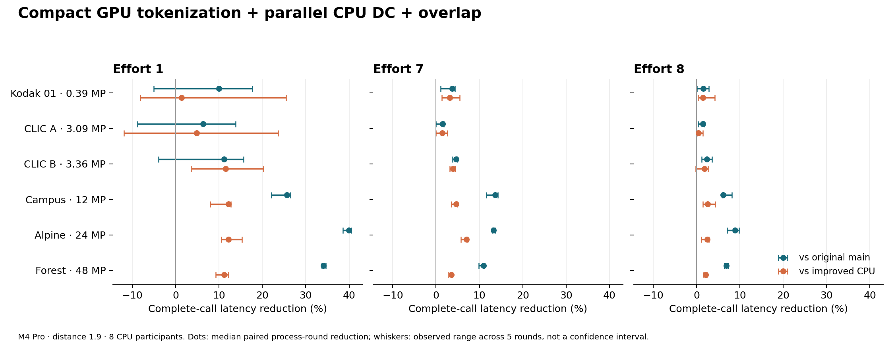

# GPU-resident tokenization and CPU DC scheduling on M4 Pro

Decision report, 22 September 2026. Measurements were collected in `perf/gpu-tokenization-20260922`, based on `7659cac8d933a9f6d41f1155503c7ca99fc46e6c`. The qualified implementation is committed as `59d976152937a5a2e171c87be83254569273a3c9`. The original dirty main checkout was preserved. The main tables describe the fully qualified V7 path; a subsequent pure-DCT8 group-fusion experiment has its own repeated comparison below.

**Finding.** GJXL had substantial achievable headroom on this machine. Exact GPU AC tokenization is feasible, and the combined implementation reduces ordinary complete-call latency on the three 12–48 MP images by **25.7–40.0% at e1, 10.9–13.6% at e7, and 6.1–8.9% at e8**. The incremental reduction against parallel DC plus parallel CPU token cleanup is **11.2–12.2% / 3.5–7.0% / 2.1–2.6%**, respectively. These are ranges of the three image-specific paired medians, not a universal speedup claim.

**Checkpoint policy.** This commit preserves the measured experimental controls: GPU tokenization remains opt-in, while parallel DC groups are enabled in the candidate. Parallel CPU token cleanup remains a control and a possible separate CPU optimization. The observed gains support a subsequent reversible default-on rollout with an explicit CPU override, followed by broader measurements to refine automatic selection. That is a deployment choice under incomplete workload coverage; this study does not establish universal superiority or an absolute hardware optimum. The known 24 MP/e1 batch regression remains part of the evidence.

## What changed

Tracked source changes include [DC-group scheduling](../../src/codestream/dc_group.cpp), the [serializer producer/overlap seam](../../src/codestream/encoder.cpp), the [resident handoff](../../src/codestream/workflow.cpp), and concurrent scratch/idle-pool bounds. The implementation also includes the [Metal host producer](../../src/gpu/metal/metal_ac_tokenization.cpp), [kernels](../../src/gpu/metal/kernels/ac_tokenization.metal), [provider interface](../../src/codestream/ac_tokenization_provider_internal.h), and independent oracle/failure tests. This report, plots, aggregate measurements, validation logs, and provenance are tracked. Individual captures, frozen executables, and screening archives remain local, ignored artifacts; [the artifact inventory](ARTIFACTS.md) distinguishes the two.

- CPU workers tokenize independent DC groups into fixed output slots. Each group's weighted predictor remains sequential and unchanged; publication order and coding decisions stay exact. CPU participation and concurrent scratch are bounded.
- The GPU borrows the existing final quantized coefficient buffer. It computes transform nonzeros and last positions, completes the top/left prediction map, scans exact token offsets, then emits ordered values/contexts and integer fixed-HybridUint populations. The CPU still selects orders, contexts, entropy models, and writes the final bitstream.
- A compact shared-buffer lease supplies split token spans directly to the CPU. A capacity hint permits one warm GPU submission. Writes are bounded; overflow grows the buffer and retries before token spans are published. Buffers use the existing budget-aware cache and remain owned until readers finish.
- CPU DC work runs between GPU Begin and Finish. The selected emitter uses one thread per DCT8 channel only for pure-DCT8 frames; mixed frames retain the SIMD emitter. One histogram shard and 128 threads per threadgroup were selected after screening.
- The CPU control parallelizes destruction of large direct-token buffers after their readers finish. This exposed meaningful complete-call cost outside the narrow AC phase timer. Its contribution must not be attributed to GPU arithmetic.



## Complete-call results

Apple M4 Pro, 14 CPU / 20 GPU cores, 48 GB; macOS 15.6; Apple clang 17 / Xcode 26.3. Fully resident Metal, nominal Q80/distance 1.9, eight CPU participants. Separate Release builds use the same parent revision and the same capture harness. Single-image captures use the production-aligned backend-injected workflow helper with a persistent backend; the batch harness uses ordinary public APIs. Six frozen inputs, efforts 1/7/8, five process rounds, four ordinary/profiled pairs per process: **360 processes, 1,440 ordinary and 1,440 profiled measured calls**, plus references/warmups. All outputs match across methods and rounds.

`Main` is the untouched parent encoder. `DC8` adds bounded DC-group parallelism. `CPU+` adds parallel CPU token cleanup. `GPU+overlap` adds the selected GPU producer and CPU/GPU overlap to DC parallelism. Timing columns are medians of five process medians. Percentage columns are medians of the five same-round relative reductions; they can differ slightly from the ratio of displayed timing medians. Round order reverses/rotates. Input loading, equality checks, and destruction of returned public results are outside the complete-call timer; internal serializer cleanup is inside.

| Image | Effort | Main ms | DC8 ms | CPU+ ms | GPU+overlap ms | Saving vs main | Saving vs CPU+ |
| --- | --- | --- | --- | --- | --- | --- | --- |
| Kodak 01 (0.39 MP) | 1 | 7.10 | 6.80 | 6.67 | 6.42 | 9.9% | 1.4% |
| Kodak 01 (0.39 MP) | 7 | 16.15 | 16.08 | 16.07 | 15.57 | 3.7% | 3.1% |
| Kodak 01 (0.39 MP) | 8 | 26.92 | 26.82 | 26.90 | 26.58 | 1.5% | 1.5% |
| CLIC A (3.09 MP) | 1 | 18.73 | 18.82 | 18.72 | 17.80 | 6.4% | 4.9% |
| CLIC A (3.09 MP) | 7 | 61.75 | 61.82 | 61.74 | 61.04 | 1.5% | 1.4% |
| CLIC A (3.09 MP) | 8 | 88.99 | 88.72 | 88.49 | 87.73 | 1.5% | 0.5% |
| CLIC B (3.36 MP) | 1 | 25.29 | 24.50 | 25.43 | 22.51 | 11.2% | 11.5% |
| CLIC B (3.36 MP) | 7 | 71.69 | 71.80 | 71.42 | 68.52 | 4.7% | 3.9% |
| CLIC B (3.36 MP) | 8 | 141.82 | 141.55 | 140.71 | 138.42 | 2.4% | 1.9% |
| Campus (12 MP) | 1 | 65.04 | 58.01 | 54.64 | 48.30 | 25.7% | 12.2% |
| Campus (12 MP) | 7 | 232.38 | 217.73 | 211.06 | 201.65 | 13.6% | 4.6% |
| Campus (12 MP) | 8 | 351.39 | 341.48 | 337.11 | 329.03 | 6.1% | 2.6% |
| Alpine (24 MP) | 1 | 130.95 | 112.43 | 89.42 | 78.59 | 40.0% | 12.2% |
| Alpine (24 MP) | 7 | 400.65 | 384.62 | 373.57 | 347.40 | 13.3% | 7.0% |
| Alpine (24 MP) | 8 | 590.50 | 571.75 | 550.82 | 538.60 | 8.9% | 2.5% |
| Forest (48 MP) | 1 | 262.81 | 233.78 | 194.45 | 173.27 | 34.1% | 11.2% |
| Forest (48 MP) | 7 | 936.56 | 911.98 | 865.73 | 837.32 | 10.9% | 3.5% |
| Forest (48 MP) | 8 | 1319.51 | 1289.00 | 1255.11 | 1228.88 | 6.9% | 2.1% |



Whiskers are the observed range across five process rounds, not confidence intervals. Small images and small percentage differences require particular care. [All per-round ranges and phase summaries](profile-summary.csv), [raw process results](final-profile/results.json), and [plot PDF](complete-call.pdf) are retained.

## Batch throughput and first-call costs

The independent public batch harness repeats the same input B1/B4, with eight aggregate CPU participants and a **36 GiB managed-memory budget** shared by every variant. Three process rounds and five timed batch calls per process yield **108 processes / 540 timed batches**. The persistent batch driver is warmed first. Output validation and public-result destruction are outside the batch timer. B4 denotes four queued images; admission can reduce simultaneous work. The final column lists main/CPU+/GPU admitted counts.

| Image | Effort | Batch | Main fps | CPU+ fps | GPU fps | GPU/CPU+ paired ratio (range) | Admitted in flight |
| --- | --- | --- | --- | --- | --- | --- | --- |
| CLIC A (3.09 MP) | 1 | 1 | 53.35 | 54.54 | 56.54 | 1.046 (1.015–1.357) | 1/1/1 |
| CLIC A (3.09 MP) | 1 | 4 | 103.32 | 102.00 | 121.68 | 1.156 (1.117–1.197) | 4/4/4 |
| CLIC A (3.09 MP) | 7 | 1 | 16.19 | 16.21 | 16.43 | 1.013 (1.009–1.019) | 1/1/1 |
| CLIC A (3.09 MP) | 7 | 4 | 20.40 | 20.14 | 20.27 | 1.010 (1.002–1.013) | 4/4/4 |
| Alpine (24 MP) | 1 | 1 | 7.87 | 11.23 | 12.70 | 1.129 (1.128–1.138) | 1/1/1 |
| Alpine (24 MP) | 1 | 4 | 14.39 | 15.75 | 14.33 | 0.903 (0.869–0.951) | 4/4/4 |
| Alpine (24 MP) | 7 | 1 | 2.54 | 2.69 | 2.88 | 1.069 (1.061–1.081) | 1/1/1 |
| Alpine (24 MP) | 7 | 4 | 2.59 | 2.80 | 2.89 | 1.031 (1.023–1.032) | 2/2/2 |
| Forest (48 MP) | 1 | 1 | 3.92 | 5.14 | 5.77 | 1.135 (1.117–1.138) | 1/1/1 |
| Forest (48 MP) | 1 | 4 | 5.17 | 5.43 | 5.78 | 1.060 (1.055–1.070) | 2/2/1 |
| Forest (48 MP) | 7 | 1 | 0.95 | 1.02 | 1.04 | 1.019 (1.018–1.022) | 1/1/1 |
| Forest (48 MP) | 7 | 4 | 0.94 | 1.02 | 1.04 | 1.019 (1.019–1.026) | 1/1/1 |

The 24 MP/e1 B4 result is a repeatable regression: GPU throughput is 5–13% below CPU+ across the three rounds, with all four images admitted in every variant. This prevents a blanket batch recommendation. At 48 MP/e1, main/CPU+ admit two images while the GPU plan admits one; this row measures the common-budget policy outcome, not equal-concurrency kernel efficiency. At 24 MP/e7 all variants admit two images, and the incremental GPU throughput gain is about 3%.

The unrestricted 48 MP/e7 B4 pilot reached approximately 44 GiB of managed backing and paged heavily; its unstable timings are excluded from the qualified comparison. A 24 GiB pilot could not admit the 48 MP plan. At 36 GiB, 48 MP/e7 admits one image and trims caches after each image. Its B4 rows therefore do not demonstrate four-way CPU/GPU overlap. The budget limits reserved/backed managed capacity, not RSS; caller inputs, immutable setup, and driver allocations are excluded. Maximum observed backing across the final batch matrix was 11.37 GiB. All observed CPU peaks were at most eight, and all committed-capacity checks passed.

System-wide VM counters increased in 0 processes for pageouts and 0 for swapouts. These include background activity and are retained per process in [batch details](batch-process-details.csv); they should be considered when interpreting small effects. [Batch summary](batch-summary.csv) includes backing peaks, admission counts, and cache trimming.

The following is the first ordinary encode in each new B1 process, before warmup (median of three). It includes first-use backend/pipeline preparation. OS/driver disk caches were not reset, so these are not cold-hardware measurements.

| Image | Effort | Main ms | CPU+ ms | GPU ms |
| --- | --- | --- | --- | --- |
| CLIC A (3.09 MP) | 1 | 81.3 | 81.8 | 80.1 |
| CLIC A (3.09 MP) | 7 | 147.1 | 135.9 | 132.5 |
| Alpine (24 MP) | 1 | 197.3 | 182.6 | 174.0 |
| Alpine (24 MP) | 7 | 534.4 | 511.0 | 508.9 |
| Forest (48 MP) | 1 | 346.1 | 303.8 | 287.8 |
| Forest (48 MP) | 7 | 1050.1 | 1012.5 | 981.2 |

## Further pure-DCT8 group fusion

One additional experiment assigns a whole AC group to one GPU threadgroup. It keeps nonzero/last-position metadata in about 6 KiB of threadgroup memory, computes contiguous thread-slice prefixes, reserves a physical group interval atomically, and emits scalar per-channel streams. Group-indexed CPU views preserve the exact logical group and token order. Guarded overflow retries clear partial populations and recompute. The generic path remains available for mixed-transform frames.

At 24 MP/e1, screening reduced GPU token command time from about 4.4 ms to 2.1 ms with 256 threads. This fit behind DC work. Independent follow-up qualification used all six inputs at e1, five process rounds and four pairs per process (**90 processes / 360 ordinary samples**), plus three-image B1/B4 tests (**54 processes / 270 timed batches**) under the same 36 GiB / eight-CPU budget. Normal mixed-frame threadgroup width remains 128; the fused width is controlled separately.

| Image, e1 | CPU+ ms | V7 GPU ms | Fused GPU ms | Saving vs V7 (range) |
| --- | --- | --- | --- | --- |
| Kodak 01 (0.39 MP) | 6.11 | 7.59 | 5.79 | 15.5% (-0.9–31.5%) |
| CLIC A (3.09 MP) | 18.31 | 18.08 | 17.12 | 7.4% (-8.2–8.5%) |
| CLIC B (3.36 MP) | 24.96 | 21.83 | 22.17 | -1.4% (-9.4–5.0%) |
| Campus (12 MP) | 54.39 | 48.24 | 48.18 | 0.2% (-2.7–0.9%) |
| Alpine (24 MP) | 89.02 | 78.70 | 77.47 | 1.7% (1.3–3.7%) |
| Forest (48 MP) | 193.37 | 173.48 | 167.68 | 3.4% (2.7–4.8%) |

| Image, e1 B4 | Fused/V7 throughput (range) | Fused/CPU+ throughput |
| --- | --- | --- |
| CLIC A (3.09 MP) | 0.999 (0.996–1.021) | 1.244 |
| Alpine (24 MP) | 0.977 (0.971–0.992) | 0.907 |
| Forest (48 MP) | 1.022 (1.011–1.036) | 1.101 |

**Fusion decision:** retain it as an optional large-image latency specialization. It saved another 1.7% at 24 MP and 3.4% at 48 MP in the paired single-image medians, with positive reductions in all five rounds for those two images. The 12 MP result was inconclusive and small-image variation was substantial. It did not cure the 24 MP/e1 B4 regression; in the follow-up it was about 2.3% below V7 GPU throughput there. Halving device time therefore did not establish a batch gain. The experiment does not isolate the remaining cache, allocation, scheduling, or CPU-consumption costs.

All follow-up outputs match the independently decoded V7 codestreams. There were no unnamed dispatches, pageouts, or swapouts in the retained follow-up runs. [Follow-up latency data](group-profile-summary.csv), [batch data](group-batch-summary.csv), and [validation](group-summary.json) are separate from the main matrix; do not combine their absolute medians across runs as a new paired comparison against main.

## Why the gains exceed an AC-phase-only estimate

The preceding saved-profile feasibility analysis bounded an isolated AC-phase replacement. This implementation also parallelizes DC, changes token allocation/destruction and ownership, and overlaps GPU work with CPU DC. Some savings were outside the original fine AC timer. The stronger CPU control is necessary to identify the additional GPU-path benefit.

| Profiled 24 MP/e7 boundary | Main ms | CPU+ ms | GPU+overlap ms |
| --- | --- | --- | --- |
| Complete profiled call | 398.16 | 367.65 | 342.50 |
| Quantization pipeline | 311.90 | 306.85 | 303.08 |
| Complete serializer | 69.26 | 41.61 | 28.02 |
| DC phase | 18.25 | 3.88 | 3.82 |
| Exposed AC phase | 15.14 | 14.88 | 2.86 |
| Entropy optimization | 10.13 | 10.21 | 10.07 |
| Section writing | 9.19 | 9.21 | 9.50 |

With overlap, AC wall time excludes the interval attributed to CPU DC and represents exposed preparation/wait/reduction. It is not GPU execution duration. Fine worker-work totals can overlap and are not additive wall latency. Profiled timings are explanatory; ordinary complete calls are the primary performance boundary. GPU AC kernels are separately instrumented in the tuning screens; the regular AQ GPU-stage JSON does not include serializer token kernels.

The optimized 24 MP/e7 quantization pipeline still occupies about 88% of profiled latency. Its AC strategy evaluation, perceptual evaluation, and reconstruction remain the larger budget for further substantial high-effort gains. [GPU group summaries](gpu-stage-summary.csv) provide current-revision stage evidence. GPU utilization or bandwidth alone would not establish a percentage of theoretical encoder peak; this experiment establishes headroom empirically by preserving output and reducing complete-call time. No new Instruments capture was used for these final comparisons.

For a fixed-rest sensitivity at this optimized 24 MP/e7 point, eliminating the entire exposed AC phase would remove only about 0.8% of profiled latency. Eliminating all section writing would remove about 2.8%. These are optimistic phase-removal bounds, not expected GPU-rANS gains. Entropy writing is therefore a separate experiment with a limited single-image budget; the current result does not imply that moving every remaining step to the GPU is advantageous.

## Tuning and correctness evidence

The [work log](WORKLOG.md) records fresh allocation, cached arenas, two-submit exact compaction, guarded one-submit compaction, histogram sharding, threadgroup sizes, host reduction, scalar DCT8 emission, CPU cleanup, and overlap screens. Screens are distinct from the final repeated cohort. The first fresh-buffer version spent roughly 11 ms waiting for about 2.5 ms of GPU execution at 24 MP/e7; cached arenas reduced the exposed handoff cost. At 48 MP/e7, compact storage reduced the token working arenas from about 1 GB maximum capacity to about 148 MB in that screen. Scalar DCT8 helped pure-DCT8 low-effort frames; mixed-frame scalar emission did not justify selection.

- Independent CPU-tokenizer oracle: 2,560 submissions / 10,240 group comparisons per full run, all seven supported transforms plus mixed frames, natural/custom orders, context maps/thresholds, populations on/off, integer extremes, sparse/zero/last-position data, offsets and poisoned gaps. Dense, compact, guarded retry, scalar variants, and cache reuse were checked.
- Thirteen allocation/submission/completion failure and recovery scenarios cover retry paths, multiple live leases, repeated Finish rejection, truncated inputs, and cache trimming. Twenty DC cases cover exact predictors, worker counts, CPU caps, finite planned memory, partial launch failures, and recovery.
- The final build, including group fusion, passed **159/159 tests**, plus **9/9 explicit combined/fused-path tests**, including real workflow admission. Group fusion also passed six full oracle runs (64/128/256 threads, ordinary and forced-one-token-capacity retries) and the failure suite. The earlier V7 full run passed 158/159, with an intermittent AQ profiler-name assertion; the same assertion reproduced on the untouched baseline. The earlier AC-strategy profile failure passed 13 candidate and ten baseline isolated repetitions; both final isolated tests passed. Temporary diagnostics found registry-name lookup misses after eviction from the existing 512-slot pipeline registry. Instrumentation was reverted. The inherited intermittent profiling limitation remains recorded despite the passing final suite.
- Final captures contain 0 unnamed dispatch records. [Attribution audit](unnamed-dispatches.json), full/isolated logs, stress results, and temporary diagnostic patch are under [verification](verification/).
- All **18 distinct final codestreams** decoded successfully with independent libjxl `djxl`, with expected dimensions and recorded decoded-PFM SHA-256. Every implementation/round/batch produced the identical corresponding encoded bytes. [Decoder validation](decode/validation.json) records the decoder version/hash and commands. This establishes unchanged rate and decoded output for the cohort; it is not new quality calibration.

## Scope and reproduction

The performance cohort uses repeated photographic inputs at one distance. Higher quality/token density, mixed-image batches, other devices, other memory limits, and exhaustive maximum-compression policies need separate qualification. Synthetic sparse/dense/extreme fixtures here establish correctness, not their complete-call performance. The GPU path adds kernels, scratch policy, and lifetime complexity. A default-on follow-up should retain an explicit CPU override and measure these unqualified workload dimensions while developing its selection policy. The inherited profiler registry issue should be fixed separately before relying on arbitrarily long-lived multi-backend attribution.

The qualified source is committed as `59d976152937a5a2e171c87be83254569273a3c9` on the experiment branch; it has not been merged. GPU and parallel-release controls require `GJXL_BUILD_TOKENIZATION_EXPERIMENT=ON`; GPU selection additionally requires the environment below. DC-group parallelism is part of the candidate implementation. Main remains untouched.

```sh
GJXL_EXPERIMENT_GPU_TOKENS=1 \
GJXL_EXPERIMENT_DC_WORKERS=8 \
GJXL_EXPERIMENT_TOKEN_COMPACT=2 \
GJXL_EXPERIMENT_TOKEN_OVERLAP=1 \
GJXL_EXPERIMENT_TOKEN_SHARDS=1 \
GJXL_EXPERIMENT_TOKEN_SCALAR_DCT8=2 <encoder command>
```

For the optional group-fused specialization, additionally set `GJXL_EXPERIMENT_TOKEN_GROUP_DCT8=1` and `GJXL_EXPERIMENT_TOKEN_GROUP_THREADS=256`. It activates only for pure-DCT8 frames using the guarded compact layout. Keep it workload-selectable; the batch results do not justify enabling GPU tokenization for every workload.

[Qualification plan](qualification-plan.json), [frozen binary hashes](final-binaries.json), [hardware/compiler provenance](provenance.json), [pipeline commands](run-final.py), and the two run-config files bind the measurements. Each final run directory contains frozen executables, source diff/new files, input hashes, exact argv/environment, raw results, and per-case completion records. Use a fresh output directory for a new collection; existing manifests reject changed runner hashes, and original runner copies are retained with the frozen sources. [Analysis](analyze.py), [decoder validation script](decode.py), and [figure script](plot.py) consume retained artifacts. Measurements predate the checkpoint commits. No push, merge, or change to the original checkout was made.

The group-fusion follow-up has [its own pipeline](run-group-final.py), [binary hashes](group-final-binaries.json), [analysis](analyze_group.py), and frozen sources in `group-final-profile` / `group-final-batch`.
